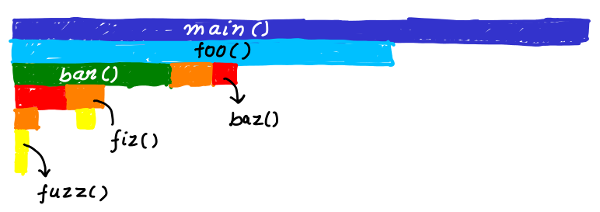

# Trace Visualization Labs

This repository contains a series of labs and guides for collecting traces from the operating system or userspace applications or cloud environments, and visualizing them with trace visualization tools. While most of the labs will use [LTTng](http://lttng.org) for trace collection and [Trace Compass](http://tracecompass.org/) for visualization, some labs may use other tools.

Each lab has specific goals and objectives. The main text is present in the README of each lab's directory and contains  various tasks outlined chronologically, to achieve the goal and complete the lab. The text also contains suggestions for navigation of the tasks. There will also be screenshots for each lab to help you guide through the UI and visualizations. Sample traces for all the labs are saved in a compressed file named [TraceCompassTutorialTraces.tgz](https://github.com/tuxology/tracevizlab/blob/master/labs/TraceCompassTutorialTraces.tgz) which can allow the user to skip reproducing the experiment and generating traces.

This lab can be reproduced, with a hands-on approach, with the tracing and visualization tools at hand. Or it can simply be read, in which case some sections of the labs, describing shorcuts and navigation options, may be skipped. Those sections are contained between :small_red_triangle_down: and :small_red_triangle: signs.

### Goals

  - Understand what tracing is and when it can be of help in diagnosing performance issues
  - Identify tracing tools and understand techniques that are used to generate traces
  - Selecting and using correct set of trace visualizations to quickly identify performance issues
  - Understand application/OS behavior and its internals using tracing

### Prerequisites

  - A Linux system or a Linux virtual machine
  - Basic understanding of Operating Systems fundamentals
  - Some experience in debugging applications and systems

## Lab developers
  - [Matthew Khouzam](https://twitter.com/DavisTurlis)
  - [Geneviève Bastien](https://twitter.com/genbastien)
  - [Mohamad Gebai](https://twitter.com/mogeb88)
  - [Suchakra Sharma](https://twitter.com/tuxology)
  - Arnaud Fiorini
  - Katherine Nadeau
