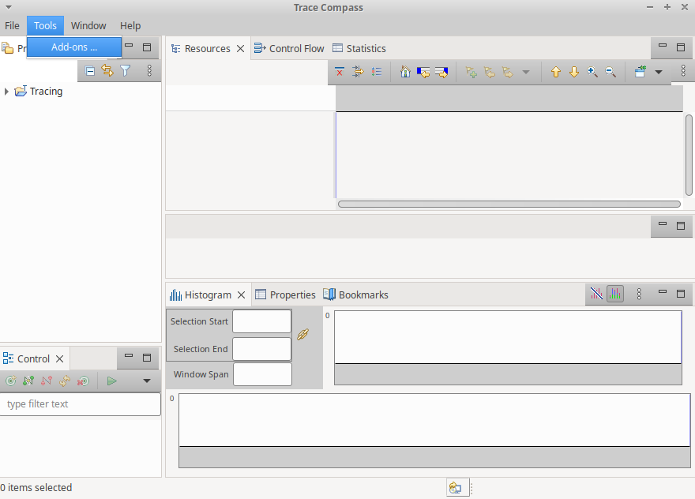
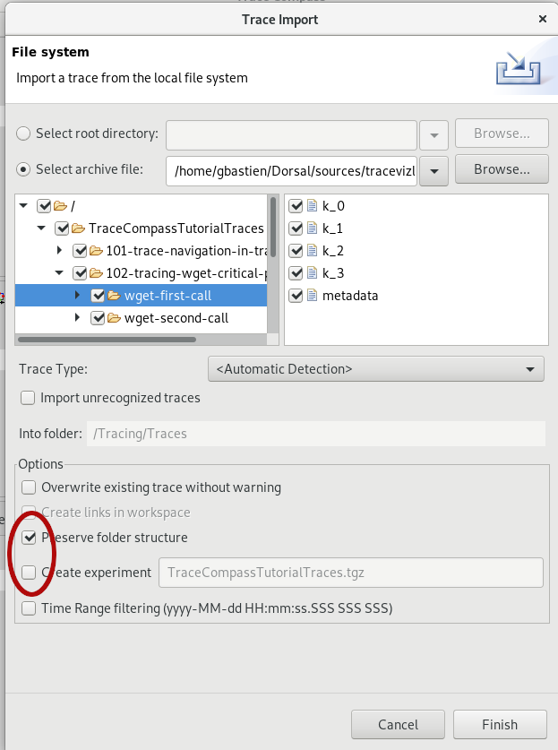
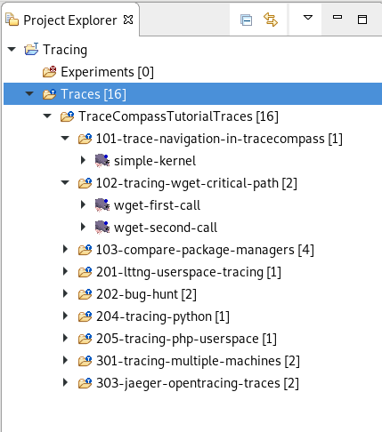

## Installing Trace Compass

In this lab, you will install Trace Compass on the machine you'll use to view the traces.

*Pre-requisites*: A viewing machine, it does not have to be a Linux machine.

- - -

### Task 1: Install Java > 8

Trace Compass is an Eclipse-based application and needs at least Java 8 to run. Make sure you have the correct version.

```
$ java -version
openjdk version "1.8.0_172"
OpenJDK Runtime Environment (build 1.8.0_172-b11)
OpenJDK 64-Bit Server VM (build 25.172-b11, mixed mode)
```

If the java command is not found or you have an older version of java installed, you need to install java. On an ubuntu machine, it would be

```
$ sudo apt-get install openjdk-8-jre
$ java -version
openjdk version "1.8.0_171"
OpenJDK Runtime Environment (build 1.8.0_171-8u171-b11-0ubuntu0.18.04.1-b11)
OpenJDK 64-Bit Server VM (build 25.171-b11, mixed mode)
```

If the version is still not correct, you may need to update your default java version using the following command

```
$ sudo update-alternatives --config java
There are 2 choices for the alternative java (providing /usr/bin/java).

  Selection    Path                                            Priority   Status
------------------------------------------------------------
* 0            /usr/lib/jvm/java-7-openjdk-amd64/jre/bin/java      1101      auto mode
  1            /usr/lib/jvm/java-7-openjdk-amd64/jre/bin/java      1101      manual mode
  2            /usr/lib/jvm/java-8-openjdk-amd64/jre/bin/java   1081      manual mode

Press <enter> to keep the current choice[*], or type selection number: **2**
```

- - -

In Windows and MacOs, download the jdk [here](https://www.oracle.com/technetwork/java/javase/downloads/jre8-downloads-2133155.html)

### Task 2: Get Trace Compass

Go to the [Trace Compass web site](http://tracecompass.org) and click on the big green button to download the latest release of Trace Compass.

Then extract the content of the downloaded archive and simply start trace-compass from the extracted folder

```
$ cd ~/Downloads
$ tar xf trace-compass-3.3.0-20180307-1910-linux.gtk.x86_64.tar.gz
$ cd trace-compass
$ ./tracecompass
```

You should reach an empty workspace. And voilà! You are now ready to import and analyze traces with Trace Compass. Proceed to other labs.


- - -

### Task 3: Install the Required Add-Ons For This Tutorial

Some labs in this tutorial require additional plugins that are not part of the main Trace Compass tool, but are available through the Trace Compass Incubator repo.  We will add those required plugins now.

To install the plugins, go to the *Tools* -> *Add-ons*



A dialog will open with a list of plugins that can be installed. For this tutorial, we will needs the following:

* **Generic Callstack (Incubator)**: For various labs
* **Global Filters (Incubator)**: For various labs
* **Trace Compass Scripting Javascript (Incubation)**: For application tracing labs
* **Trace Compass ftrace (Incubation)**: If you have system traces with ftrace
* **Trace Compass uftrace (Incubation)**: Some application traces provided in this tutorial are made by uftrace
* **Virtual Machine And Container Analysis (Incubator)**: For advanced topics with containers and virtual machine
* **Trace Compass opentracing (Incubation)**: For advanced topic with opentracing

Check those plugins in the *Install* wizard, as shown below. Then click *Finish* and follow the instructions on screen. Trace Compass will have to be restarted at the end of the process.


- - -

### Task 4: Import the Traces For The Tutorial

Each lab comes with the instructions to produce the traces yourself, so *if you plan on making your own traces, you may skip this step*. Otherwise, there is an [archive](../TraceCompassTutorialTraces.tgz) that contains all the traces for the labs. You may import it now.

Upon opening Trace Compass, there is a default project named *Tracing* in the ``Project Explorer``, expand it and right-click on the *Traces* folder. Select *Import...* to open the *Trace Import* wizard.


Check the *Select archive file* radio-button and find the archive you want to import.



The list on the left will show the folder structure inside that archive, you can select the top-level element and click *Finish*. Make sure the options are as shown above, ie the *Preserve folder structure* is **checked** and *Create experiment* is **unchecked**.

All the traces should be available, each under a folder named for the lab that uses them.



- - -

#### Next

* [Trace Navigation in Trace Compass](../101-analyze-system-trace-in-tracecompass)
or
* [Back](../) for more options
