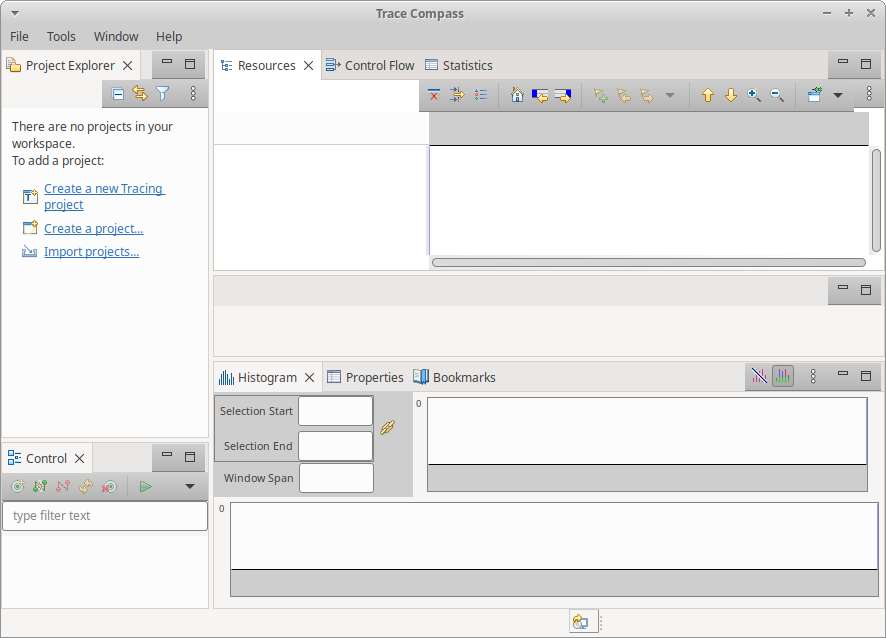

## Installing Trace Compass

In this lab, you will install Trace Compass on the machine you'll use to view the traces.

*Pre-requisites*: A viewing machine, it does not have to be a Linux machine.

- - -

### Task 1: Install Java > 8

Trace Compass is an Eclipse-based application and needs at least Java 8 to run. Make sure you have the correct version.

```
$ java -version
openjdk version "1.8.0_172"
OpenJDK Runtime Environment (build 1.8.0_172-b11)
OpenJDK 64-Bit Server VM (build 25.172-b11, mixed mode)
```

If the java command is not found or you have an older version of java installed, you need to install java. On an ubuntu machine, it would be

```
$ sudo apt-get install openjdk-8-jre
$ java -version
openjdk version "1.8.0_171"
OpenJDK Runtime Environment (build 1.8.0_171-8u171-b11-0ubuntu0.18.04.1-b11)
OpenJDK 64-Bit Server VM (build 25.171-b11, mixed mode)
```

If the version is still not correct, you may need to update your default java version using the following command

```
$ sudo update-alternatives --config java
There are 2 choices for the alternative java (providing /usr/bin/java).

  Selection    Path                                            Priority   Status
------------------------------------------------------------
* 0            /usr/lib/jvm/java-7-openjdk-amd64/jre/bin/java      1101      auto mode
  1            /usr/lib/jvm/java-7-openjdk-amd64/jre/bin/java      1101      manual mode
  2            /usr/lib/jvm/java-8-openjdk-amd64/jre/bin/java   1081      manual mode

Press <enter> to keep the current choice[*], or type selection number: **2**
```

- - -

### Task 2: Get Trace Compass

Go to the [Trace Compass web site](http://tracecompass.org) and click on the big green button to download the latest release of Trace Compass. For these labs, you may rather want to download the latest development snapshot, that can be found [here](https://www.eclipse.org/tracecompass/download.html), by following the *Development snapshots* link and selecting the proper version for your system.

Then extract the content of the downloaded archive and simply start trace-compass from the extracted folder

```
$ cd ~/Downloads
$ tar xf trace-compass-3.3.0-20180307-1910-linux.gtk.x86_64.tar.gz
$ cd trace-compass
$ ./tracecompass
```

You should reach an empty workspace. And voilà! You are now ready to import and analyze traces with Trace Compass. Proceed to other labs.


