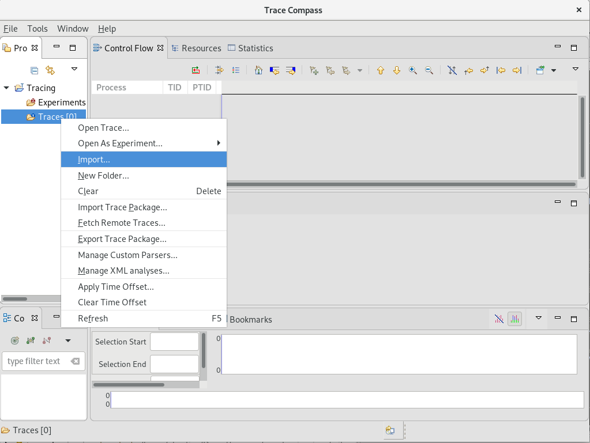
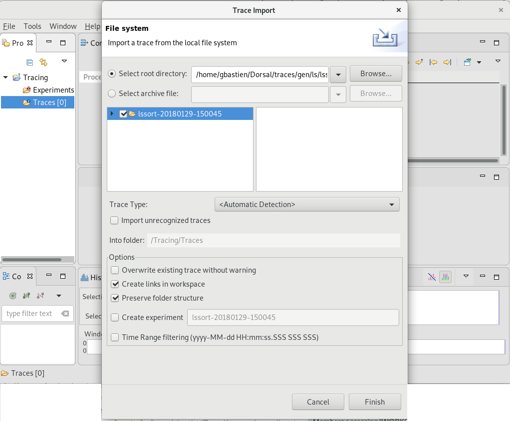
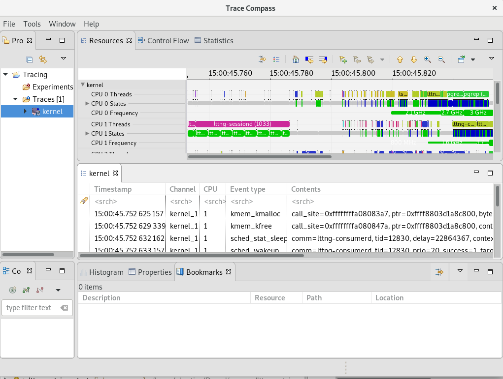
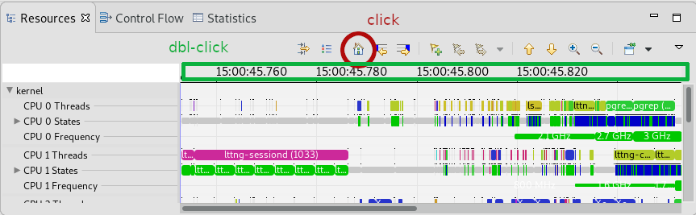
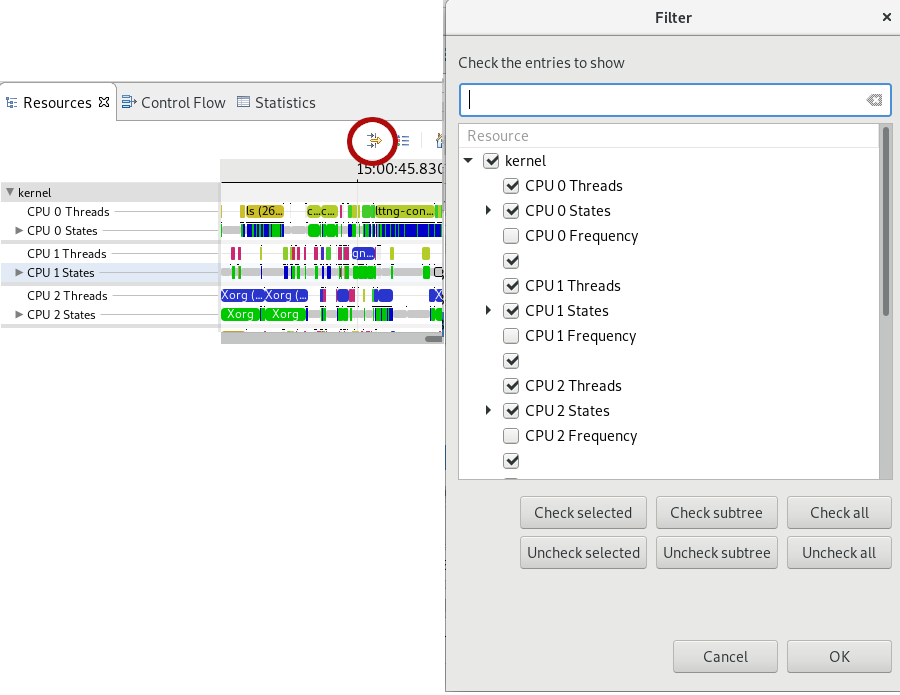
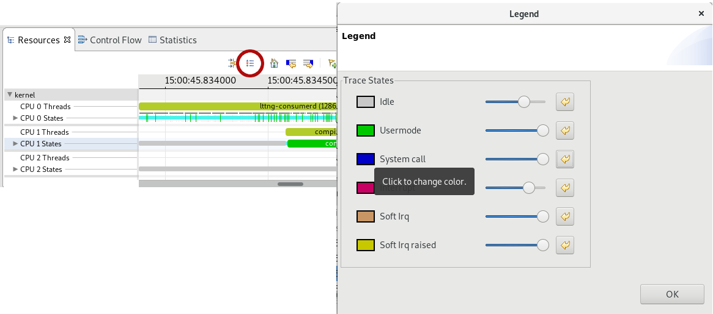

### Trace Navigation in Trace Compass

In this lab, you will learn to open a trace in Trace Compass and navigate the various views available.

*Pre-requisites*: Have Trace Compass installed and opened. You can follow the [Installing TraceCompass](00-installing-tracecompass.md) lab or read the [TraceCompass web site](https://tracecompass.org) for more information. You also need a trace to open. You can take the trace you did in the [Record a kernel trace](00-record-kernel-trace.md) lab or take one of the traces coming with this tutorial.

- - -

#### Sub-task 1: Opening a trace

Upon opening Trace Compass, there is a default project named *Tracing*, expand it and right-click on the *Traces* folder. Select *Import...* to open the *Trace Import* wizard.

Browse for the folder containing the trace, then check that folder in the left textbox as shown in the screenshot below and click *Finish*.

A trace named kernel will show up under the *Traces* folder. You can double-click on it to actually open it. This will open the *Kernel* perspective

- - -

#### Sub-task 2: Navigate in time graph views

The main view that shows when opening a kernel trace is the ``Resources`` view, showing CPUs and interrupts on the left table and statuses on the right. The scale at the top shows the time in the trace. This type of view is called a *time graph view*. Make sure this view is the one with focus by clicking on the title tab.

When the trace first opens, it shows the first 100 milliseconds of the trace.

You can **zoom out to see the complete trace** by double-clicking on the time graph scale or click on the house icon:

You can zoom in and out in time and pan the view left and right by using the ``'w', 'a', 's', 'd'`` keyboard shortcuts or ``ctrl-scroll`` and ``middle-click + mouse move``, this last one can also pan the view up and down.

The ``up`` and ``down`` arrows, and the ``mouse scroll`` moves the view up and down, while the ``left`` and ``right`` arrows will go to the next and previous events of the currently selected entry.

Time selection is done with the mouse, by ``left-clicking`` on a timestamp to select a single time, or ``left-drag`` to select a time range. Zooming in to a time range is done by ``right-drag``ging the mouse to that time range. All the opened views, as well as the events table will synchronize with the time selection and/or visible time ranges.

- - -

#### Sub-task 3: Filter out some entries in time graph views

The ``Resources`` view shows for each CPU 3 lines: the running thread, the CPU state and its frequency. Let's say we want to hide the frequency lines from the view.

Click on the ``Show View Filters`` icon at the left of the toolbar and uncheck the CPU X Frequency lines. The filter and the result are shown in the following screenshot:

- - -

#### Sub-task 4: Change the color of the states

Views like the ``Resources`` view have built-in colors for some of the states that are displayed. For instance, the **Running** state is green, **System call** is blue, **Idle** is green and the line is thinner.

To get the meaning of the colored states and change their style (color, width), you can click on the ``Legend`` icon. The window that opens shows the legend of the current view and allows to change the colors by cliking on the color rectangle, or the width by using the gradient line right of the name. The arrow button at the end of each line will reset to defaults.

In the following screenshot, we've change the color and width of the **System call** state.

- - -

#### Sub-task 5: Open more analyses and views

- - -

#### Sub-task 6: Navigate in XY Views

- - -

#### Conclusion
