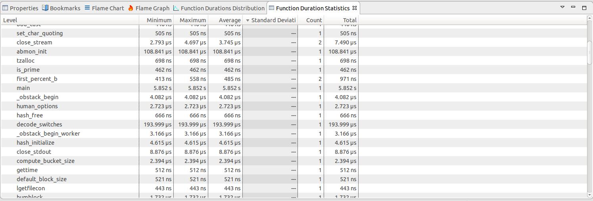
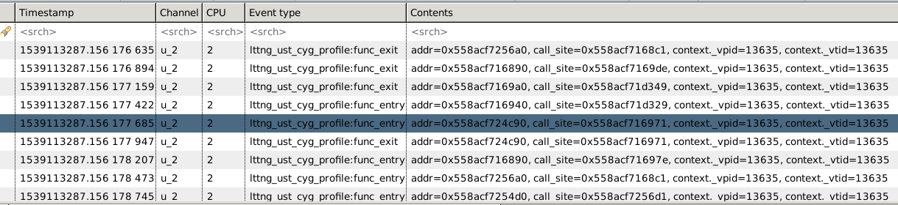
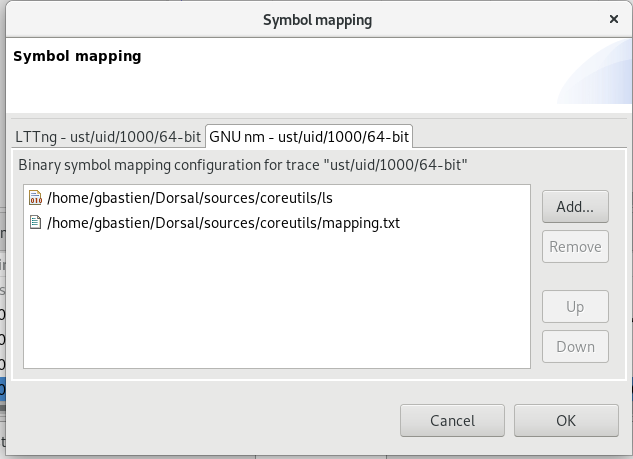
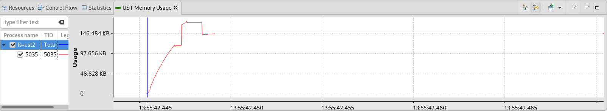

### LTTng Userspace Tracing

In this lab, you will learn to compile for tracing and analyze C/C++ programs, using LTTng UST. We will see the various analyzes available with the builtin lttng userspace libraries.

*Pre-requisites*: Have Trace Compass installed and opened. Have git, lttng and the callstack add-on on Trace Compass installed. You can follow the [Installing TraceCompass](00-installing-tracecompass.md) lab or read the [TraceCompass web site](https://tracecompass.org) for more information.

- - -

#### Sub-task 1: Compiling and tracing `ls` from coreutils

In this lab you will use the coreutils package to compile and trace the `ls` command. In order to do that we need the source code for this package which can be download with git:

```bash
git clone git://git.sv.gnu.org/coreutils
```

Then you will need to compile `ls` with the proper flags by running these commands in coreutils/:

```bash
$ ./bootstrap
$ ./configure CFLAGS="-g -O2 -finstrument-functions"
$ make
```

[clang](https://linux.die.net/man/1/clang) and [gcc](https://linux.die.net/man/1/gcc) have the flag `-finstrument-functions` which generates instrumentation calls for function entry and exit. A more detailed explanation can be found [here](https://lttng.org/docs/v2.10/#doc-liblttng-ust-cyg-profile). Then after compiling coreutils the `ls` executable is located in `coreutils/src/`.

You can generate the trace using the following command in the `coreutils/` directory:

```bash
$ lttng-record-trace -p cyg_profile,libc ./src/ls -l
```

or to manually create the trace, the following commands can be run
```bash
$ lttng create
$ lttng enable-channel u -u --subbuf-size 1024K --num-subbuf 8
$ lttng enable-event -c u -u lttng_ust_cyg_profile*,lttng_ust_statedump*
$ lttng add-context -c u -u -t vpid -t vtid
$ lttng start
$ LD_PRELOAD=liblttng-ust-cyg-profile.so,liblttng-ust-lib-wrapper.so ./src/ls -lR
$ lttng stop
$ lttng destroy
```

These tracing commands will trace 2 types of events:

* The function entry/exits because the program was compiled with the proper instrumentation and the `liglttng-ust-cyg-profile.so` library was LD_PRELOADed.
* The libc function calls, like malloc and free, done by the application, simply by LD_PRELOADing the `liblttng-ust-libc-wrapper.so` library.

- - -

#### Sub-task 2: Visualizing cyg profile traces

In the previous sub-task, you generated a trace of the `ls` command that contains all the function calls. You can open this trace on Trace Compass and you should see in the *Project Explorer View*, under Views, the *LTTng-UST CallStack* tree view. Under this, four views are present:

* The *Flame Chart View* shows the state of the stack at all moments during the trace. That view shows for all threads of the application, the functions that were called, so it's easy to see who called who and when. If you do not see human-readable names for the functions, see the next section of this lab.


* The *Flame Graph View* looks similar to the *Flame Chart View* but it is different. Each box represents a function in the stack but the horizontal axis show the total aggregated duration of all calls to this function at a particular level. A more complete explaination is available [here](http://www.brendangregg.com/FlameGraphs/cpuflamegraphs.html#Description).


`For a more complete understanding of the difference between Flame Charts and Flame Graphs`, see [this additional document](FlameChartsVsFlameGraphs.md)

* The *Function Durations Distribution View* is a bar graph that shows the number of function calls with respect to their duration. The count is using a logarithmic scale. In this example it shows that very few functions takes longer than 0.5 seconds.


* The *Function Duration Statistics View* is a table with each function's minimum, maximum, average duration and other statistical parameters that may show that in certain cases, the duration can be bigger or lower depending on the context. In this case `print_dir` can take a long time to execute depending on the size of the directory.



- - -

#### Sub-task 3: Understanding the symbols

The events used to populate this view are lttng_ust_cyg_profile[\_fast]:func_entry and lttng_ust_cyg_profile[\_fast]:func_exit. In the events fields, there's the 'addr' field that is used to identify the function being called. Depending on which machine you are now viewing this trace, the one where the trace was taken or not, the flame chart view will display the human readable name of the function or the cryptic 'addr' field.



If Trace Compass is running on the machine where the trace was taken (the target), you should see the function names directly. That's because you also recorded the ``lttng_ust_statedump:*`` events. Some of them contain the absolute path to the binary files. So if those files are available, there will be automatic source lookup of the symbols and translation to the human readable name of the function.


If you are not running Trace Compass on the machine where the trace was taken, chances are the binary files being traced is not present at the path in the events, or else it is, but it's not exactly the same version, so symbols will not be right. In those cases, you need to configure how to resolve the symbols. To do this, you can right-click on the trace and select `Configure symbols` from the menu, or click on the symbol configuration icon in the views.


You have several options. For automatic source lookup, you can set the root directory under which the files from the target are located. The directory specified should contain full directory structure of the target, so let's say a file being trace is `/usr/local/bin/ls`, and the target root directory is `/home/me/target`, it is expected there will be a file `/home/me/target/usr/local/bin/ls`. This is a typical case for embedded system where the target OS was compiled on another machine and sent to the target.


If you do not have the full file system of the target, you can just add the files containing the symbol resolution. They can be either

* the binary that was used for taking the trace.
* a file generated from the binary using `nm myprogram > mapping.txt`. If you are dealing with C++ executables, you may want to use `nm --demangle` instead to get readable function names.



For this lab, if you did not produce the trace yourself on the machine used for viewing, you can add the executable file provided in the `traces/` directory.

- - -

#### Sub-task 4: Memory usage

The trace was recorded using the lttng-ust libc wrapper, to trace calls to libc functions for memory allocation/deallocation. With the trace opened in Trace Compass, under *Views*, you may expand the *Ust Memory* analysis and see the views for this analysis.

* The *UST Memory Usage* views shows in time when the memory was allocated and freed, per thread. The UST memory view can show the memory usage of an application as it executes, when more memory was needed, when it was freed. In conjunction with the *Callstack* analysis views, it can be used to see more greedy code paths.



* The *Potential Leaks* view shows the memory that was allocated during the trace but not freed. This could be totally normal if the trace does not span the whole lifetime of a process/thread, or it can be some still reachable memory that does not pose a leak.


* The *Potential Leaks vs time* view shows the same information as the *Potential Leaks* view, but as a scatter chart, so it's possible to visually see in time when exactly the memory was allocated.

*Note* The potential leaks views are not meant to detect real memory leak. For that, tools like [Valgrind](http://valgrind.org/) are better suited and will tell you the exact line of code where the leak happened. But sometimes, knowing where the leaked memory was allocated does not help with the why it was not freed. In those cases, seeing it here with the full execution trace (callstacks, path to/from allocation), can help better put it in context. Also, adding a kernel trace to it, could add information, for instance show a failed system call around that time which may give a hint as to why it was not deallocated.

- - -

#### Conclusion

In the lab, you have compiled a program with tracing helpers, traced the `ls` command and saw the builtin views available for `LTTng UST` traces, ie the *LTTng-UST CallStack* and the *UST memory* views. You should now be able to analyze the execution of an application in details in terms of memory usage and function calls.
