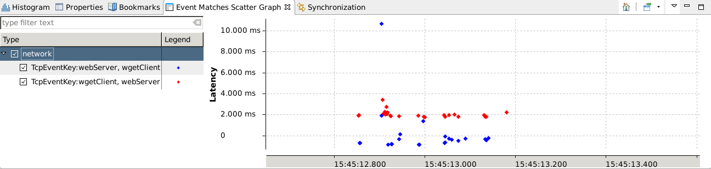
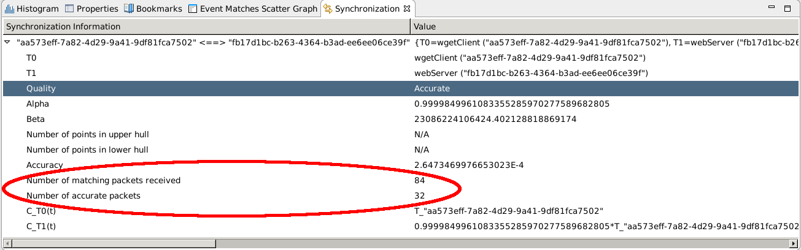
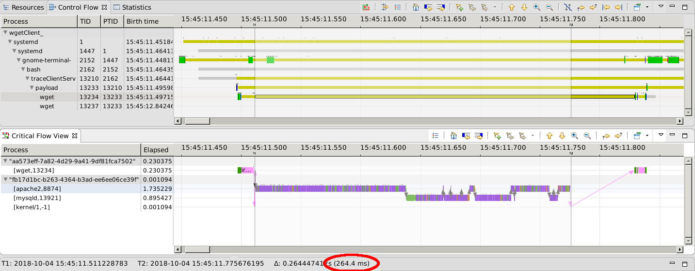
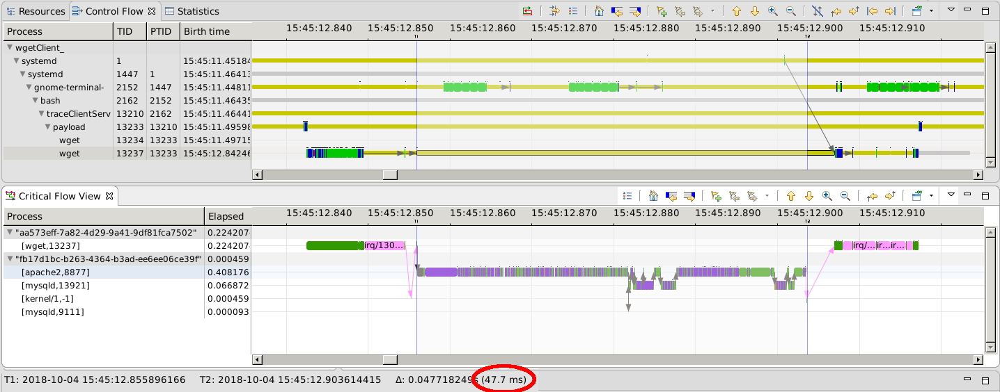

### Tracing multiple machines across a network

In this lab, you will learn to take traces from multiple machines that communicate through the network and how Trace Compass can analyze those traces from different machines, with different time clocks.

*Pre-requisites*: This lab is a followup of the *[Tracing wget](../01-tracing-wget-critical-path/01-tracing-wget-critical-path.md)* lab: we obtained 2 traces of wgetting a same web page twice. We saw that the 2 requests had 2 very different durations. Now, we will also trace the website that is being fetched to see what happens there during this request on the server side. For this lab, you can use the traces provided in this repository. The lab explains how to generate your own traces, but to do so, you would need to have 2 machines, preferably physical machines, as clocks on virtual machine are a bit trickier and are the subject of their own lab later.

- - -

#### Sub-task 1: Getting the trace

While it is easy to just start an lttng session on one machine and obtain a local trace, tracing multiple machines requires more operations to control tracing and collect traces afterwards. There is no blessed way of doing this unfortunately; everyone develops their own techniques and writes their script.

The easiest way is to start/stop tracing manually on each machine, run your workload, then stop the tracing. Of course, to do it really manually will result in traces that are longer than necessary if the workload is small, like in this case, but it can be a good approach to trace a situation that may happen in the coming minutes. Scripting the tracing will make smaller traces that span just the necessary time.

We'll describe one possible approach to this kind of tracing here. We will trace 2 machines, one acting as a client (running the wget commands) and a server (serving the requests), so the tracing will be controlled from the client. We'll be using the 3 following bash scripts:

On the **server machine**, place the following script somewhere. We'll put it in ``~/setupKernelTrace``. This **creates a tracing session** with all required events. The trace will be saved to the trace directory sent in parameter (this allows to easily know where the trace is located, so how to retrieve it later), otherwise a name with the data will be computed for the trace.

```
#!/bin/bash

NAME=$1

if [ -z "$NAME" ]
then
	NAME=trace_$(date +"%y%m%d_%H%M")
fi

lttng create --output ~/lttng-traces/$NAME
lttng enable-channel --kernel --num-subbuf 8 --subbuf-size 1024K more-subbuf
# scheduling
lttng enable-event -k --channel more-subbuf sched_switch,sched_waking,sched_pi_setprio,sched_process_fork,sched_process_exit,sched_process_free,sched_wakeup
lttng enable-event -k --channel more-subbuf irq_softirq_entry,irq_softirq_raise,irq_softirq_exit
lttng enable-event -k --channel more-subbuf irq_handler_entry,irq_handler_exit
lttng enable-event -k --channel more-subbuf --syscall --all
lttng enable-event -k --channel more-subbuf lttng_statedump_process_state,lttng_statedump_start,lttng_statedump_end,lttng_statedump_network_interface,lttng_statedump_block_device
# Block I/O
lttng enable-event -k --channel more-subbuf block_rq_complete,block_rq_insert,block_rq_issue
lttng enable-event -k --channel more-subbuf block_bio_frontmerge,sched_migrate,sched_migrate_task
# cpu related
lttng enable-event -k --channel more-subbuf power_cpu_frequency
# network events
lttng enable-event -k --channel more-subbuf net_dev_queue,netif_receive_skb,net_if_receive_skb
# timer events
lttng enable-event -k --channel more-subbuf timer_hrtimer_start,timer_hrtimer_cancel,timer_hrtimer_expire_entry,timer_hrtimer_expire_exit
# Additional events for wifi
#lttng enable-event -k --channel more-subbuf --function netif_receive_skb_internal netif_receive_skb_internal
#lttng enable-event -k --channel more-subbuf --function do_IRQ do_IRQ

```

On the **client machine** the following script will start the tracing on the server, then record a trace of the payload, finally stop the trace on the server and bring the trace to this machine. We'll save it as ``~/traceClientServer``

```
#!/bin/bash

USER=$1
SERVER=$2
if [ -z "$USER" || -z "$SERVER" ]
then
	echo "Usage: ./traceClientServer <ServerUserName> <ServerHostOrIp>"
	echo ""
	echo "Example: ./traceClientServer myUser 5.5.5.2
	exit 0
fi

TRACE_NAME = serverTrace

# Start tracing on the server side through ssh
ssh $USER@$SERVER ./setupKernelTrace $TRACE_NAME
ssh $USER@$SERVER lttng start
# Record the client payload
# If the client is a machine with wifi, replace this call to a full manual setup
# of the kernel trace and uncomment the lines for the additional kernel --function lines
lttng-record-trace ./payload
# Stop tracing the server
ssh $USER@$SERVER lttng destroy

# Get the trace from the server
rsync -avz $USER@$SERVER:~/lttng-traces/$TRACE_NAME ./
```

Finally, the following script on the **client machine** will contain the payload to trace, here 2 wgets of a web site.

```
#!/bin/bash

wget http://www2.dorsal.polymtl.ca
sleep 1
wget http://www2.dorsal.polymtl.ca
```

After execution of those traces, you should have 2 traces on your working directory: one called ``payLoad-<date>`` and one called ``serverTrace``, from respectively the client and the server. These 2 traces will be imported in Trace Compass in the next step.

> Note on **wifi**: If one of the machines connects to the network through wifi, the traces taken with the default events will not show the critical path through the network. To do so, additional events will be required. For now, with lttng, **tracing the following kernel functions** should make the dependency analyses possible:
>
> lttng enable-event -k --channel more-subbuf --function netif_receive_skb_internal netif_receive_skb_internal
>
> lttng enable-event -k --channel more-subbuf --function do_IRQ do_IRQ

- - -

#### Sub-task 2: Importing the traces in an experiment

In Trace Compass, under the project on which to import the traces, right-click on the *Traces* folder. Select *Import...* to open the *Trace Import* wizard.

Browse for the folder containing the traces, then check each folder containing the traces on the left side. You should have two folders checked. In the options below, make sure the *Create experiment* is checked, with an experiment in the textbox beside the option, as shown in the screenshot below.


The traces will be imported. Then expand the *Experiments* folder to see the experiment that was just created with the 2 traces in it. Double-click on the experiment to open it.


- - -

#### Sub-task 3: Synchronizing the traces

The 2 traces were taken on different machines that communicated together using HTTP to get the web page. This means there will be events in the traces representing the exchange of TCP/IP packets, namely ``net_dev_queue`` and ``net[_]if_receive_skb`` for sending and receiving packets. The data in those events allow to match the event corresponding to the sending from one machine with the event corresponding to the reception on the other machine.

Under the experiment, expand *Views*. There is an analysis called ``Event Matching Latency``. Expand it, then open the ``Event Matches Scatter Graph``. Make sure the trace is fully zoomed out and you should see two communication streams, check them to see the latencies. This analyses matches send and receive events and shows the latency between the 2 events.

Unless the 2 machines' clocks are perfectly synchronized, the 2 streams should appear as 2 very distinct series, one of which may even be in the negatives. That means events are received before they are sent!



If the 2 machines are physical machines, they are independent and what happens on one does not affect the other. But in a case like ours, where they communicate through the network and we want to analyze the dependencies across the network, it is important that the timestamps of both traces use the same time reference, so that dependent events always happen in the right order (for example, a packet should always be sent before it is received).

Trace Compass uses a trace synchronization algorithm to automatically calculate a formula to transform the timestamps of one trace into the time reference of the other trace. Before synchronizing, let's open the *Synchronization* view, by clicking the *Window* -> *Show view* (or type *Ctrl-3*) and type and select the ``Synchronization (Tracing)`` view.

Right-click on the experiment and select *Synchronize traces...*. A window will open to select a reference trace. Any one will do in this case, so use the default selected one and click *Finish*. The trace synchronization task will run. It may take a while. At the end, the experiment will be closed.


Open the experiment again, the ``Synchronization`` should show the result of the synchronization, which is hopefully ``accurate``, showing the number of packets matched and the number of packets that served to calculate the formula.



Look at the ``Event Matches Scatter Graph`` view again. You should see now that both series overlap quite nicely and latencies are always positive.


All the analyzes for this experiment will be re-run now that the traces are synchronized and this time, the timestamps will use the same time reference.

- - -

#### Sub-task 4: Analyze the requests

When analyzing experiments with traces from different machines, most views of Trace Compass will simply show data from both traces. For example, the ``Control Flow`` view will show all threads under an element corresponding to the trace name. The 2 traced machines being independent, there is little else to do for most views than to just aggregate the data of both traces.

Where there is added value in having an experiment is to calculate the distributed critical path of a thread. We traced a web request, there is communication between the machines, we can follow the critical path from the client to the server and back to the client.

Open the ``Control Flow`` view and the ``Critical Flow`` view (either with *Window* -> *Show View*, or ``ctrl-3`` and typing the view name, or expanding the corresponding analysis under the trace, ie ``Linux Kernel`` and ``OS Execution Graph``).

With focus on the ``Control Flow`` view, find the *wget* processes: press ``Ctrl-f`` and type *wget* in the search box. It will select the first *wget* process. Right-click on the process and click on ``Follow wget/<tid>``. This will trigger the ``OS Execution Graph`` analysis and at the end, the distributed critical path for this wget request will be shown.



In the *[Tracing wget](../01-tracing-wget-critical-path/01-tracing-wget-critical-path.md)*, we saw that most of the *wget* critical path was spent waiting on the network. Now with this experiment, that *waiting for network* part is replaced by the server side critical path, where the apache/mariadb processes each play a role. We see a lot of disk access. This request has not been made in a long time and its data, php code, as well as database, needs to be fetched from disk.

Now in the ``Control Flow`` view, select the second *wget* process and right-click it to follow the process and calculate its critical path. This time, we see a lot less disk accesses on the server side, and thus a much shorter request than the first time. The data for the request was already on memory, which improves the query time.



Now, this analysis was done only with kernel traces from the client and server. We can clearly see the network and disk accesses on the critical path. What a simple kernel trace does not say is whether the time improvement of the second request is only due to in-memory request data, or if the web application also did something to help increase the speed of the second query. Is there some mechanism in the application that improved the query time or is it just simply OS-related. Another lab will show how to also trace the userspace on the server side to get more information from these requests.

- - -
References:

[Trace synchronization algorithm](http://dmct.dorsal.polymtl.ca/sites/dmct.dorsal.polymtl.ca/files/Jabbarifar-Dec6.pdf)

**Additional notes on synchronization**:

Note that the trace synchronization algorithm used in Trace Compass computes a linear formula to transform the timestamps. It is only an approximation, sufficient for the analyzes, as computer clocks do not have this linear correlation and after a while, a drift may appear between the clocks that will invalidate the linear formula. It means that at some point, it will be impossible to compute a linear formula covering the whole duration of the traces and the synchronization will be marked as ``failed``. Depending on the hardware, the approximation here can be valid for trace durations varying from minutes to hours.

When dealing with virtual machines, the synchronization approach described here is rarely successful even for traces of a few seconds. The drift factors enters in very soon. Luckily in those cases, other approaches are available. See [this blog post](http://versatic.net/tracecompass/synchronization/2018/01/15/synchronization-and-ntp.html) for more details.
