## Analyze System Trace in Trace Compass

In this lab, you will learn to open a system trace in Trace Compass and navigate the various views available. We will look at a simple system trace when running the `wget` command and see what kind of information we can get from it.

*Pre-requisites*: Have Trace Compass installed and opened. You can follow the [Installing TraceCompass](../006-installing-tracecompass) lab or read the [TraceCompass web site](http://tracecompass.org) for more information. You also need a trace to open. You can take the trace you did in the [Record a kernel trace](../003-record-kernel-trace-lttng) lab or take the `tracing-wget/wget-first-call` trace from the tutorial's archive.

- - -

### Task 1: Opening a trace

*If you are using the traces provided as archive with the labs follow the steps outlined in `Import the Traces For The Tutorial` in [Installing Trace Compass](../006-installing-tracecompass) and skip ahead to the end of this task to double-click on `tracing-wget/wget-first-call`*

Expand the *Tracing* project created in [Installing Trace Compass](../006-installing-tracecompass), and right-click on the *Traces* folder. Select *Import...* to open the *Trace Import* wizard.

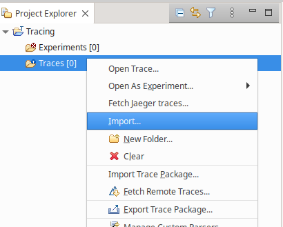

Browse for the folder containing the trace, then check that folder in the left textbox as shown in the screenshot below and click *Finish*.

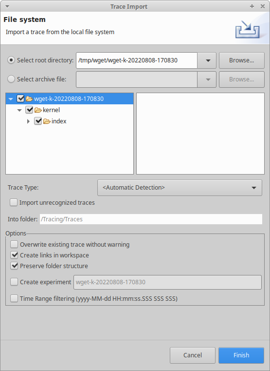

A trace named `kernel` will show up under the *Traces* folder. You can double-click on it to actually open it. With the tutorial archive, you open the `tracing-wget/wget-first-call` trace.

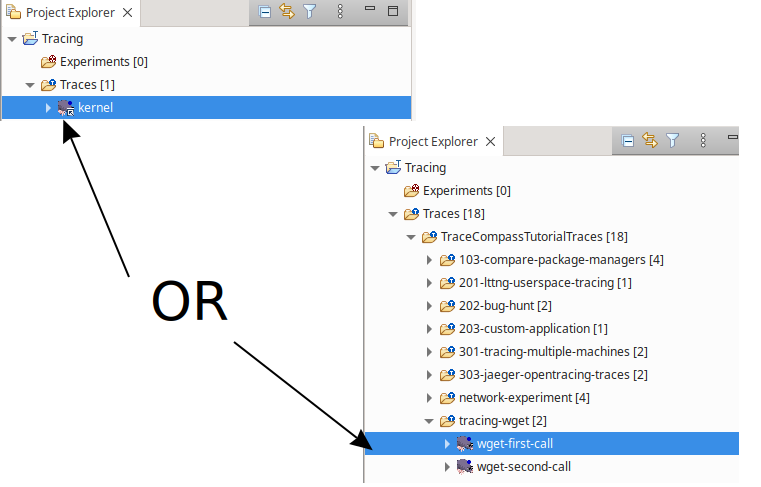

- - -

### Task 2: Navigate in time graph views

The main view that shows when opening a kernel trace is the ``Resources`` view, showing CPUs and interrupts on the left table and their statuses on the right. The scale at the top shows the time in the trace. This type of view is called a *time graph view*. Make sure this view is the one with focus by clicking on the title tab.

:exclamation: The `Resources` view gives an overview of what is happening in the system. It is a good starting point if you are looking at a system's problem, or investigating some unexplainable latencies. It can give you in one glance a feeling of how busy the system was, how long were the processes on the CPU, how many interrupts happened, etc. It can help figure out what to do next when you are not sure what to look at. The first line, named *CPU X Threads* shows the thread on CPU, each of different color, the second line, *CPU X States* shows the state of the thread, whether userspace, kernel, or interrupted. The third line, *CPU X Frequency*, shows the frequency of the CPU.

When the trace first opens, it shows the first 100 milliseconds of the trace.

You can **zoom out to see the complete trace** by double-clicking on the time graph scale or click on the house icon:

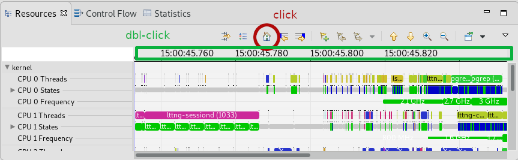

:small_red_triangle_down:

You can zoom in and out in time and pan the view left and right by using the ``w``, ``a``, ``s``, ``d`` keyboard shortcuts or ``ctrl-scroll`` and ``middle-click + mouse move``, this last one can also pan the view up and down.

To reduce the size of entries, so that you can see more of them on the screen at the same time, you can press `ctrl- -`. It will make the view unreadable, but puts everything on screen, so it can show obvious potential problems. `ctrl- +` will increase the size again and `ctrl-0` will bring it back to default.

The ``up`` and ``down`` arrows, and the ``mouse scroll`` moves the view up and down, while the ``left`` and ``right`` arrows will go to the next and previous events of the currently selected entry.

Time selection is done with the mouse, by ``left-clicking`` on a timestamp to select a single time, or ``left-drag`` to select a time range. Zooming in to a time range is done by ``right-dragging`` the mouse to that time range. All the opened views, as well as the events table will synchronize with the time selection and/or visible time ranges.

:small_red_triangle:

Another interesting time graph view for kernel traces is the `Control Flow` view. The corresponding tab should be right next to the `Resources` view in the perspective.

:exclamation: The `Control Flow` view shows the state of every thread in the system during the trace. When you know or have identified a thread of interest, you can find it in this view, see its hierachy and what it has been doing during tracing.

For this lab, the process of interest would be `wget` and we can find it in the `Control Flow` view by doing `ctrl-f` with the view in focus and typing `wget`.

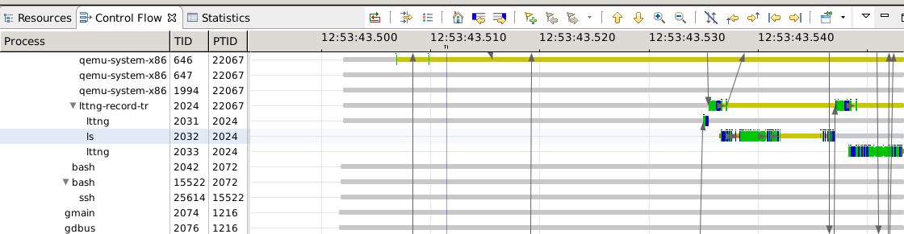

- - -

### Task 3: Filter out some entries in time graph views

Traces generated by LTTng, like the one provided for this lab, have enabled the statedump events. The statedump will have dumped a list of all threads on the system, as well as their status at the moment of the statedump. These thread will thus be visible in the ``Control Flow`` view but they will remain inactive all through the trace.

It is possible to filter out the threads that are not active during the current window range. To do so, we first select more or less the range we are interested in (we may expand to the whole trace range if we want to remove inactive threads for the whole trace).

Click on the ``Show View Filters`` icon at the left of the toolbar and click on the ``Uncheck inactive`` button. This may take a while, then the inactive threads will be unchecked from the thread tree. You can then continue checking/unchecking threads as needed. The filter and the result are shown in the following screenshot:

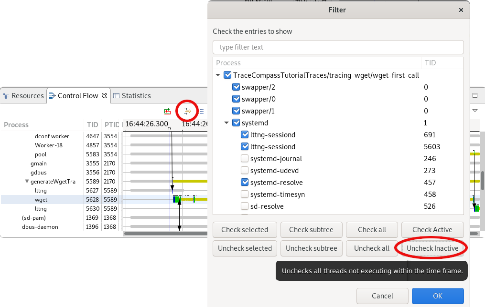

#### Task 3.1: Filter and search in time graph views

It is also possible to search and filter in time graph views. Using the `Resources` view, with the view in focus, press the `/` key. It will open a small dialog with a looking glass at the bottom of the view. Whatever string you enter in this textbox will be searched for in the states and dim the other states.

For instance, let's write `wget` in the textbox and it will highlight the states that contain that string, that's the `wget` process we traced.

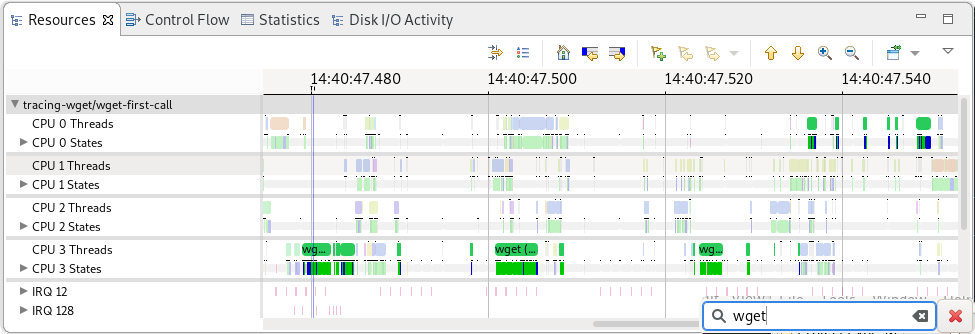

Pressing `Enter` on the textbox will completely hide all states that do not correspond to the filter. The filter will be removed by clicking the red X.

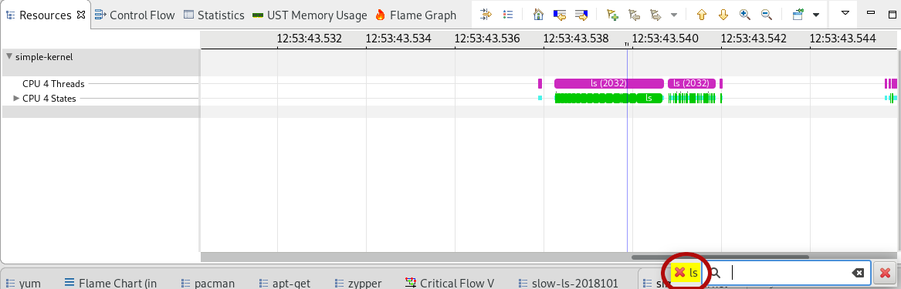

This search & filter feature looks at the content of the tooltip of the states. A simple string will try to match with the content of any key of the tooltip, but one can also search for a key/value pair. The syntax of the filters is similar to that of `wireshark`. Here are some search strings that will work on the trace:

* `wget|lttng` will highligh threads containing `wget` or `lttng`
* `TID contains 56` will highlight all threads whose TID contains `56`
* `TID matches 5628` will highlight the thread with ID `5628`
* `System_call matches .*` will highlight all state with system calls (they are visible only when zoomed)

More information on this filtering can be found [here](http://archive.eclipse.org/tracecompass/doc/stable/org.eclipse.tracecompass.doc.user/Trace-Compass-Main-Features.html#Filtering_Time_Events_in_Time_Graph_Views).

- - -

### Task 4: Change the color of the states

:small_red_triangle_down:

Views like the ``Resources`` and ``Control Flow `` view have built-in colors for some of the states that are displayed. For instance, the **Running** state is green, **System call** is blue, **Idle** is grey and the line is thinner.

To get the meaning of the colored states and change their style (color, width), you can click on the ``Legend`` icon. The window that opens shows the legend of the current view and allows to change the colors by cliking on the color rectangle, or the width by using the gradient line right of the name. The arrow button at the end of each line will reset to defaults.

In the following screenshot, we've changed the color and width of the **System call** state.

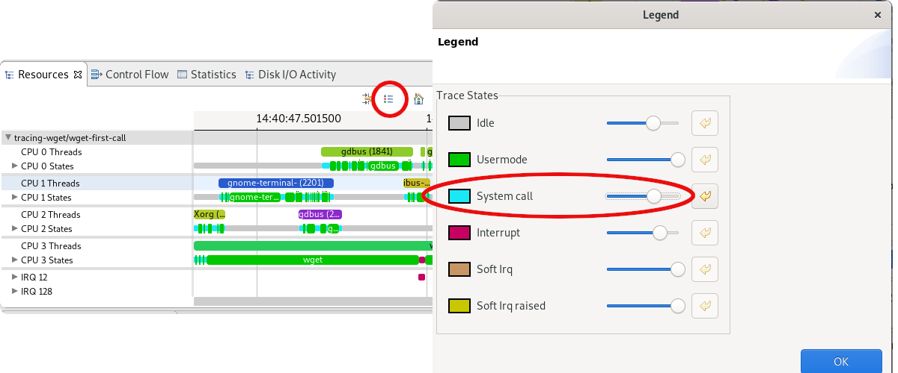

:small_red_triangle:

- - -

### Task 5: Use the histogram to navigate the trace

There's a view at the bottom of the window called ``Histogram``.

:exclamation: The `Histogram` shows the density of events in time, so you can see in one glance where in the trace the most events occurred. At the bottom is the full time range of the trace and above is the window range, ie the visible range in the other views. This view can be used to navigate the trace, as you can change selection and visible range in both sections of the view.

:small_red_triangle_down:

In any of those 2 histogram boxes, ``left-click + drag`` will change the selection range, while ``right-click + drag`` will change the visible range. You may also manually change the selection range or the zoom level by editing the text boxes on the left.

You can play with the visible and selection ranges with this view and observe how the other views are updated. The following screenshot summarizes those concept.

:small_red_triangle:

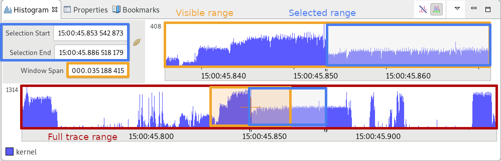

- - -

### Task 6: Open more analyses and views

:exclamation: One of the central concepts of Trace Compass is the concept of *analysis*. An analysis can be defined as a function of events, or function of other analyses, that transforms the trace's data into something meaningful. Typically, analyses will focus on some aspects of a system, look at subsets of events and store results in on-disk data structures made for this purpose. Depending on the events contained in the trace, not all analyses may be available for all traces.

*Views* are then used to display the analysis results to the user in an easily understandable way.

In the ``Project Explorer`` view, the trace we are analyzing can be expanded. Under it are 3 elements: ``Views``, ``External Analyses`` and ``Reports``. The analyses we will be using in this tutorial are under the ``Views`` element, so let's expand it.

It shows a list of available analyses for this trace. Under each analyses are the views that can be opened to analyze the trace.

Here is an expanded view of the trace in the `Project Explorer`.

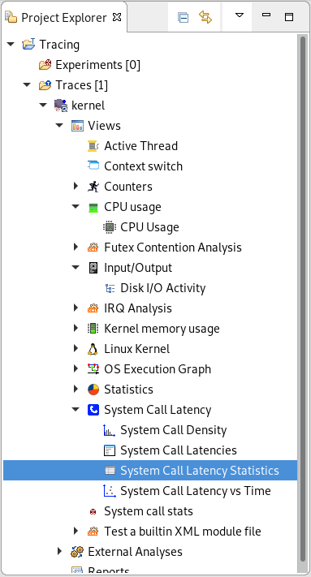

We have previously seen the *time graph views*. In the next tasks, we will introduce 2 new types of views: statistics views and XY views.

- - -

### Task 7: Explore the Latencies Views

Let's now open the ``System Call Latency Statistics`` under the ``System Call Latency`` analysis.

:exclamation: It shows statistics on the times taken to execute system calls by the various processes in the trace, for each system call. There is the minimum and maximum time taken, the average and standard deviation, the number of calls and the total spent in that kind of system call. It can be used to see if there are any abnormal latencies in the kernel space wrt system calls, and investigate the said latencies.

:small_red_triangle_down:

Now click on the column headers to sort the results by this column. For each line of system call, if you right-click on it, you can navigate to the time range of minimum and maximum duration, as shown in the figure below, where we selected the maximum range.

Now that you have a time range selected, you can scroll up (or down depending on current sorting) the statistics view and notice that the statistics are shown both for the total duration of the trace and for the current time selection. So whenever you select a new time range in the trace, the selection statistics will be updated.

:small_red_triangle:

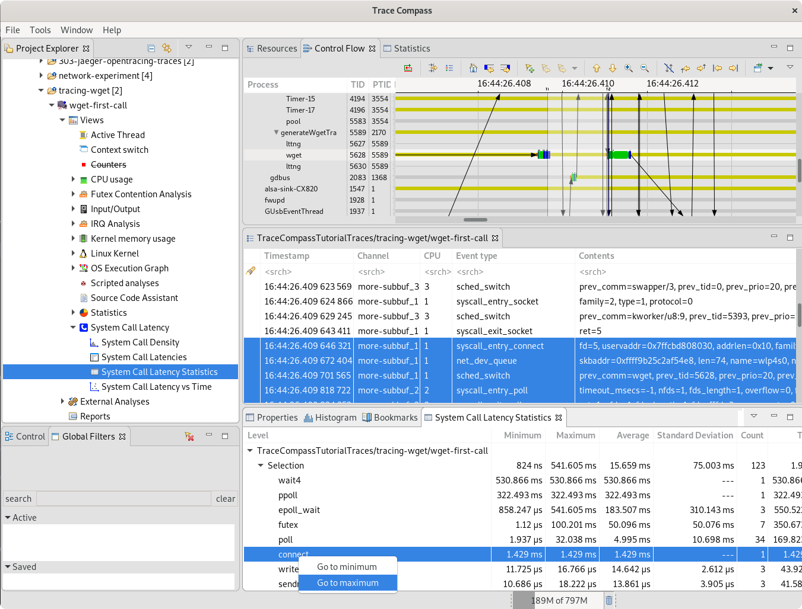

There are other types of latencies views with latency analyses. There are `System Call Density`, `System Call Latencies` and `System Call Latency vs Time`. They all show different views of the same data.

:exclamation: The `System Call Latencies` view lists all the system call with their duration, calling thread and return value. I can be used to query individual system call latencies, selecting any row will select the time range.

:exclamation: The `System Call Latency vs Time` will display the system calls as a scatter chart, with time as X axis. It is useful to see when in the trace, our elements of interest had the highest latency. In the following screenshot, we see that a **select** system call took almost 300 ms around the middle of the range. We could explore that range further if that is problematic for us.

:exclamation: The `System Call Density` view shows the number of system that took a certain duration within the visible range. The table on the left shows the various elements. We can sort them by duration to see the information on the longest system call of that range.

:small_red_triangle_down:

It is possible to filter the system calls in those view by any of the visible columns of the `latency table`, through the `Global Filters` view. To open this view, select `Window` -> `Show View`, then select the `Global Filters` view. Or you can press `ctrl-3` and enter `Global Filters` in the textbox that appears.

For instance, if we want to see the system calls only the `wget` process, we could add the `TID == 5628` filter in the `Global Filters` view and the system calls will be filtered accordingly:

* The `latency table` will show only the system calls for this process
* The `latency vs time` view will display in different color the system calls that are not selected
* The `density` view is not affected

:small_red_triangle:

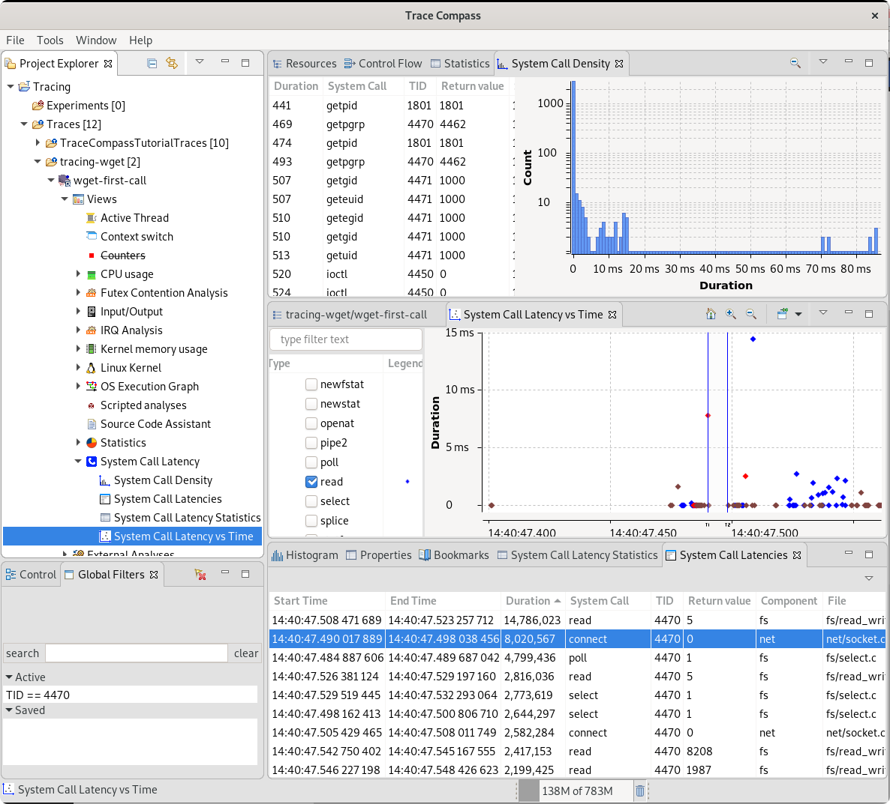

Those 4 views described here are available for every "latency" analysis. They may not all make sense for every case, but they are available by default. A few other analyses make use of that for a kernel trace, namely the `IRQ Analysis` which analyses the latencies of IRQ handlers in the kernel.

Also, the `Futex Contention Analysis` shows which threads were waiting for futexes. It can be used to detect areas of higher contention in the trace.

- - -

### Task 8: Navigate in XY Views

Let's now look at one the XY views, for example we can open the ``CPU Usage`` view under the `CPU usage`. This view is split in two, with a checkbox tree on the left side and an XY chart on the right side. If the view is too small, you can ``double-click on the tab`` of the view to make it full window size.

:exclamation: The `CPU Usage` view shows an XY chart of the CPU usage of threads during the visible window. The numbers on the left show the % of CPU Usage for each thread, where 100% per thread is the expected maximum, as a thread runs on only 1 CPU. The total duration is among all available CPUs so for 8 CPUs, 800% would be the expected maximum. It is a complement to the `Resources` view as here, you can select a specific thread and see its CPU utilization as a graph, whereas the states in the `Resources` view may not make that obvious.

By default, this view shows the total CPU usage in time. The checkbox tree on the left shows the list of threads that were active on the CPU during the current window range (ie the visible time).

You can enlarge the left side to make all columns visible by ``left-click and drag`` the bar that separates the 2 sections of the view. It will show for each entry the TID, the % of CPU utilization, the total time spent on CPU and the legend. You can sort that table by clicking on the the column headers.

You can check the individual threads to display their CPU usages on the chart on the right, as shown in the figure below.

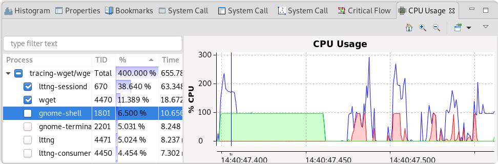

Double-clicking on the tab again will reduce the view to its original size.

Another similar view is the `Disk I/O Activity` view, under the `Input/Output` analysis.

:exclamation: The `Disk I/O Activity` view shows the read and write operations on the disk, so can be used to see how busy the disks were. The reads and writes cannot be matched with a specific thread. A thread's reads and writes are done on files that are often in memory, but they may sometimes need to go to the disk, in which case a system call will typically wait for the result from the disk thread. Only those disk accesses would be visible here.

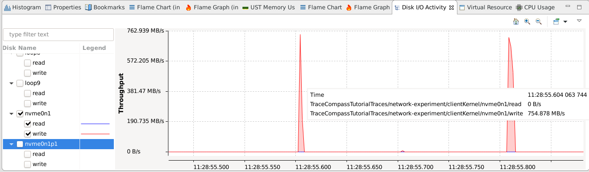

- - -

### Task 9: So what? This is such a simple trace!

If you took the trace from the record lab, it should be a very small trace. The one provided with this lab is bigger, but the wget part is also very small, with only a single thread. But even the simplest commands such as `wget`, or even `ls` can hide some interesting issues...

The following screenshot for instance was taken from a trace of `ls -al`, on a shared disk. The `ls` command lasted 3 seconds! And we see it was blocked most of the time.

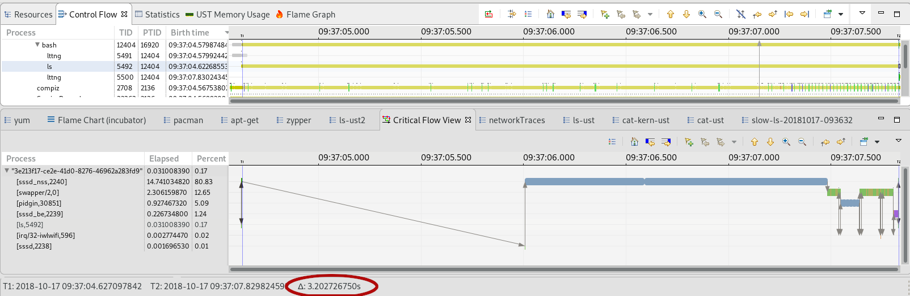

The view above is called the `Critical Flow` view and will be the subject of the [next lab](../102-tracing-wget-critical-path).

For now, let's just say that in this case, it shows that `ls` was waiting on `sssd` to resolve the user/group of the files to display them. With an Active Directory of more than 100K users, that took a lot of time. Once that was brought to the attention of the system administrators, a simple configuration option was sufficient to bring the `ls` performance to expected values.

- - -

### Conclusion

In the lab, we've introduced the Trace Compass builtin functionnalities for system traces. You should know the various views available for this kind of trace and when to use each type. We've also spent time exploring the navigation through a trace's range in the different views. Those skills will be very handy for the rest of this tutorial.

- - -

#### Next

* [Getting the Critical Path of Wget](../102-tracing-wget-critical-path)
or
* [Back](../) for more options
