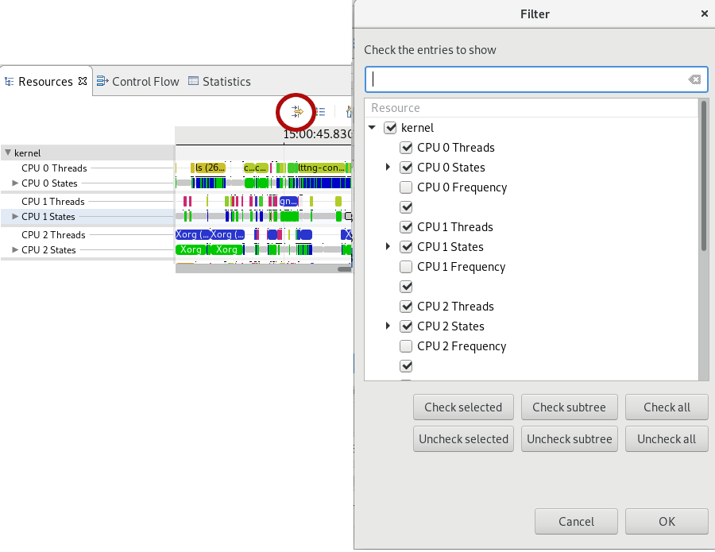
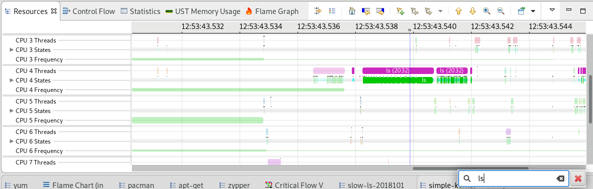

## Trace Navigation in Trace Compass

In this lab, you will learn to open a trace in Trace Compass and navigate the various views available. We will see in future labs what each of those views mean and what we can make of it.

*Pre-requisites*: Have Trace Compass installed and opened. You can follow the [Installing TraceCompass](../006-installing-tracecompass) lab or read the [TraceCompass web site](http://tracecompass.org) for more information. You also need a trace to open. You can take the trace you did in the [Record a kernel trace](../003-record-kernel-trace-lttng) lab or take the trace that comes with this tutorial.

- - -

### Task 1: Opening a trace

Upon opening Trace Compass, there is a default project named *Tracing* in the ``Project Explorer``, expand it and right-click on the *Traces* folder. Select *Import...* to open the *Trace Import* wizard.

Browse for the folder containing the trace, then check that folder in the left textbox as shown in the screenshot below and click *Finish*. If you are using the traces provided as archive with the labs, you may directly import the archive by selecting the *Select archive file* radio button and browsing to the trace `.tar.gz` file.

A trace named kernel will show up under the *Traces* folder. You can double-click on it to actually open it. This will open the *Kernel* perspective

- - -

### Task 2: Navigate in time graph views

The main view that shows when opening a kernel trace is the ``Resources`` view, showing CPUs and interrupts on the left table and statuses on the right. The scale at the top shows the time in the trace. This type of view is called a *time graph view*. Make sure this view is the one with focus by clicking on the title tab.

When the trace first opens, it shows the first 100 milliseconds of the trace.

You can **zoom out to see the complete trace** by double-clicking on the time graph scale or click on the house icon:

You can zoom in and out in time and pan the view left and right by using the ``'w'``, ``'a'``, ``'s'``, ``'d'`` keyboard shortcuts or ``ctrl-scroll`` and ``middle-click + mouse move``, this last one can also pan the view up and down.

The ``up`` and ``down`` arrows, and the ``mouse scroll`` moves the view up and down, while the ``left`` and ``right`` arrows will go to the next and previous events of the currently selected entry.

Time selection is done with the mouse, by ``left-clicking`` on a timestamp to select a single time, or ``left-drag`` to select a time range. Zooming in to a time range is done by ``right-dragging`` the mouse to that time range. All the opened views, as well as the events table will synchronize with the time selection and/or visible time ranges.

Another interesting time graph view for kernel traces is the `Control Flow` view. The corresponding tab should be right next to the `Resources` view in the perspective. This view shows every thread in the system and their status at different time. While the `Resources` view shows a quick overview of the whole system, the `Control Flow` view is interesting to follow a specific process or thread that we are interested in. For instance, for this lab, the process of interest would be `ls` and we can find it in the `Control Flow` view.

- - -

### Task 3: Filter out some entries in time graph views

The ``Resources`` view shows for each CPU 3 lines: the running thread, the CPU state and its frequency. Let's say we want to hide the frequency lines from the view.

Click on the ``Show View Filters`` icon at the left of the toolbar and uncheck the CPU X Frequency lines. The filter and the result are shown in the following screenshot:

#### Task 3.1: Filter and search in time graph views

It is also possible to search and filter in time graph views. Using the `Resources` view again, with the view in focus, press the `/` key. It will open a small dialog with a looking glass at the bottom of the view. Whatever string you enter in this textbox will be searched for in the states and dim the other states.

For instance, let's write `ls` in the textbox and it will highlight the states that contain that string, that's the `ls` process we traced, along with some `alsa` and `pulseaudio`-related threads ;-)

Pressing `Enter` on the textbox will completely hide all states that do not correspond to the filter. The filter will be removed by clicking the red X.

This search & filter feature looks at the content of the tooltip of the states. A simple string will try to match with the content of any key of the tooltip, but one can also search for a key/value pair. The syntax of the filters is similar to that of `wireshark`. Here are some search strings that will work on the trace:

* `ls|lttng` will highligh threads containing `ls` or `lttng`
* `TID contains 20` will highlight all threads whose TID contains `20`
* `TID matches 2072` will highlight the thread with ID `2072`
* `System_call matches .*` will highlight all state with system calls (they are visible only when zoomed)

As of this writing, this feature works well only on the `Resources` view. More information on this filtering can be found [here](http://archive.eclipse.org/tracecompass/doc/stable/org.eclipse.tracecompass.doc.user/Trace-Compass-Main-Features.html#Filtering_Time_Events_in_Time_Graph_Views).

- - -

### Task 4: Change the color of the states

Views like the ``Resources`` view have built-in colors for some of the states that are displayed. For instance, the **Running** state is green, **System call** is blue, **Idle** is grey and the line is thinner.

To get the meaning of the colored states and change their style (color, width), you can click on the ``Legend`` icon. The window that opens shows the legend of the current view and allows to change the colors by cliking on the color rectangle, or the width by using the gradient line right of the name. The arrow button at the end of each line will reset to defaults.

In the following screenshot, we've changed the color and width of the **System call** state.

- - -

### Task 5: Use the histogram to navigate the trace

There's a view at the bottom of the window called ``Histogram``. This view shows the density of events in time, so you can see in one glance where in the trace the most events occurred. At the bottom is the full time range of the trace and above is the window range, ie the visible range in the other views. This view can be used to navigate the trace, as you can change selection and visible range in both sections of the view.

In any of those 2 histograms, ``left-click + drag`` will change the selection range, while ``right-click + drag`` will change the visible range. You may also manually change the selection range or the zoom level by editing the text boxes on the left.

You can play with the visible and selection ranges with this view and observe how the other views are updated. The following screenshot summarizes those concept.

- - -

### Task 6: Open more analyses and views

One of the central concepts of Trace Compass is the concept of *analysis*. An analysis can be defined as a function of events, or function of other analyses, that transforms the trace's data into something meaningful. Typically, analyses will focus on some aspects of a system, look at subsets of events and store results in on-disk data structures made for this purpose. Depending on the events contained in the trace, not all analyses may be available for all traces.

*Views* are then used to display the analysis results to the user in an easily understandable way.

In the ``Project Explorer`` view, the trace we are analyzing can be expanded. Under it are 3 elements: ``Views``, ``External Analyses`` and ``Reports``. The analyses we will be using in this tutorial are under the ``Views`` element, so let's expand it.

It shows a list of available analyses for this trace. Under each analyses are the views that can be opened to analyze the trace.

Here is an expanded view of the trace in the `Project Explorer`.

We have previously seen the *time graph views*. In the next tasks, we will introduce 2 new types of views: statistics views and XY views.

- - -

### Task 7: Explore the statistics views

Let's now open the ``System Call Latency Statistics`` under the ``System Call Latency`` analysis. It shows statistics on the times taken to execute system calls by the various processes in the trace, for each system call. We have the minimum and maximum time taken, the average time and the standard deviation, the number of calls and the total spent in that kind of system call.

Now click on the column headers to sort the results by this column. For each line of system call, if you right-click on it, you can navigate to the time range of minimum and maximum duration, as shown in the figure below, where we selected the maximum range.

Now that you have a time range selected, you can scroll up (or down depending on current sorting) the statistics view and notice that the statistics are shown both for the total duration of the trace and for the current time selection. So whenever you select a new time range in the trace, the selection statistics will be updated.

- - -

### Task 8: Navigate in XY Views

Let's now look at one the XY views, for example we can open the ``CPU Usage`` view under the `CPU usage`. Click on the tab of the view to put it into focus. This view is split in two, with a checkbox tree on the left side and an XY chart on the right side. If the view is too small, you can ``double-click on the tab`` of the view to make it full window size.

By default, this view shows the total CPU usage in time. The checkbox tree on the left shows the list of threads that were active on the CPU during the current window range (ie the visible time).

You can enlarge the left side to make all columns visible by ``left-click and drag`` the bar that separates the 2 sections of the view. It will show for each entry the TID, the % of CPU utilization, the total time spent on CPU and the legend. You can sort that table by clicking on the the column headers.

You can check the individual threads to display their CPU usages on the chart on the right, as shown in the figure below.

Double-clicking on the tab again will reduce the view to its original size.

- - -

### Task 9: So what? This is such a simple trace!

If you took the trace from the record lab, or the trace that comes with this lab, it traced the `ls -al` command, and it should be a very small trace. But even the simplest command such as `ls` can hide some interesting issues...

The following screenshot for instance was taken from a trace of `ls -al`, on a shared disk. The `ls` command lasted 3 seconds! And we see it was blocked most of the time.

The view at the bottom is called the `Critical Flow` view and will be the subject of the [next lab](../102-tracing-wget-critical-path).

For now, let's just say that in this case, it shows that `ls` was waiting on `sssd` to resolve the user/group of the files to display them. With an Active Directory of more than 100K users, that took a lot of time. Once that was brought to the attention of the system administrators, a simple configuration option was sufficient to bring the `ls` performance to expected values.

- - -

### Conclusion

In the lab, you've opened a trace in Trace Compass and should now know what types of views are available and some basic functionnalities and navigation options with each type. You should also be able to find the various views available for a trace and navigate through those views' ranges. Those skills will be very handy for the rest of this tutorial.

- - -

#### Next

* [Getting the Critical Path of Wget](../102-tracing-wget-critical-path)
or
* [Back](../) for more options
