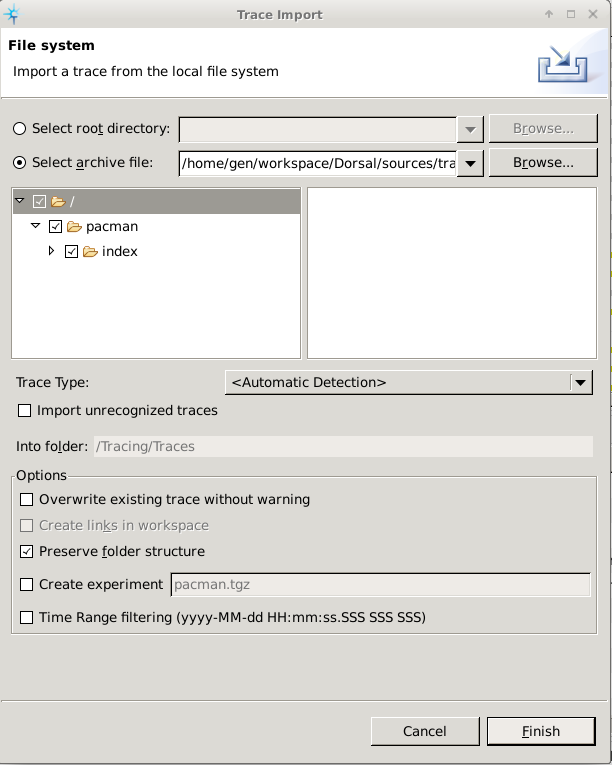
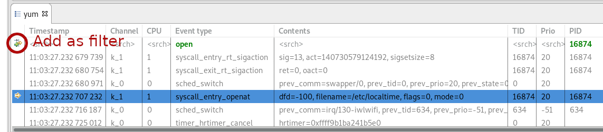
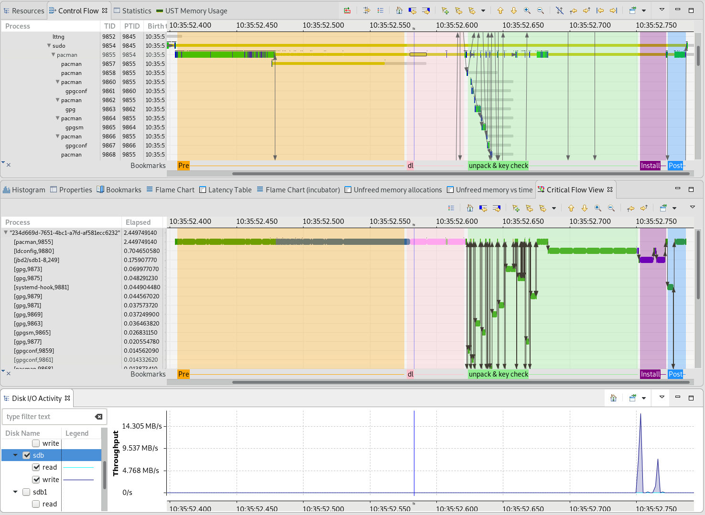

## Compare Package Managers

In this lab, we will use kernel tracing to compare the behaviors of common utility that varies from linux distro to linux distro: package managers. They all do the same thing: install a package on the system, but they are quite different. You will also learn to search and filter in time graph views and make bookmarks to identify regions of interest in the trace.

*Pre-requisites*: Have Trace Compass installed and opened. You can follow the [Installing TraceCompass](../006-installing-tracecompass/) lab or read the [TraceCompass web site](http://tracecompass.org) for more information. You should have done the [Trace Navigation in Trace Compass](../101-analyze-system-trace-in-tracecompass) and the [Wget Critical Path](../102-tracing-wget-critical-path) labs.

- - -

### Task 1: Obtain the Traces

Since most people have only one distro around them (though people reading this may be the type to have more), we have provided with this lab the necessary traces for some common package managers installing the `tree` package: `apt` (debian-flavor), `yum` (Red Hat flavor), `pacman` (Arch Linux) and `zypper` (OpenSuse).

In TraceCompass, you can import the trace directly as an archive file.

Right-click on the project's `Traces` folder in TraceCompass and click *Import*. The import wizard will open. Check the *Select archive file* radio-button and find the archive you want to import.

The list on the left will show the folder structure inside that archive, you can select the top-level element and click *Finish*



You can also obtain your own trace for your favorite package manager with some variation on this command:

```
$ lttng-record-trace sudo apt install tree
```

Import the archive for each of the package manager, they should now appear under the `Traces` directory.

Package managers are by default a bit verbose, so we can clearly follow the different phases of installing a package. For each trace, we will add the command that was executed to get it, along with its text output. By looking at the kernel trace, try to identify the various phases of the installation process.

We'll try to identify a few common phases in each trace:

* Getting package information (pre)
* Downloading package (dl)
* Unpacking (unpack)
* Installing the package (inst)
* Post-installation steps, setting up man pages (post)

- - -

### Task 2: Observe apt

First let's open the `apt` trace. We'll go into details for this first trace analysis. Then the subsequent traces will show mostly the results.

The command that allowed to get this trace:

```
$ sudo apt install tree
Reading package lists... Done
Building dependency tree       
Reading state information... Done
The following NEW packages will be installed:
  tree
0 upgraded, 1 newly installed, 0 to remove and 45 not upgraded.
Need to get 46.1 kB of archives.
After this operation, 106 kB of additional disk space will be used.
Get:1 http://debian.bhs.mirrors.ovh.net/debian testing/main amd64 tree amd64 1.7.0-5 [46.1 kB]
Fetched 46.1 kB in 0s (136 kB/s)
Selecting previously unselected package tree.
(Reading database ... 275002 files and directories currently installed.)
Preparing to unpack .../tree_1.7.0-5_amd64.deb ...
Unpacking tree (1.7.0-5) ...
Setting up tree (1.7.0-5) ...
Processing triggers for man-db (2.8.4-2+b1) ...
```

Since we're interested in a single process, the `Control Flow` view would be the first place to look for it. Let's first find it, by pressing `ctrl-f` with focus on the view. A search dialog will appear and enter `apt`, then click *Finish* or press `Enter`. The view should focus on the first entry with that name, which should be our process.

We notice the process has quite a few children processes and threads. The main thread is often in the blocked state, waiting for some other event to complete.

To understand the intricacies of the relation between the threads/processes and see what it's waiting on, let's do the critical path of our main process: Open the `Critical Flow` view, right-click on the `apt` process in the `Control Flow` view and click `Follow apt`.

Now let's try to identify the various phases of the process. Once we identify a phase with more or less precision, we can bookmark it in the view. First, we need to select the time range to bookmark, then click on the *Add bookmark...* icon (the little flag with a + sign). This will open the *Add Bookmark* dialog, where you can enter a short description (the name of the phase) and the color for this bookmark.


We can then easily come back to a bookmark by selecting it in any view that supports bookmarks. It will automatically select the proper time range and the status bar at the bottom will show the duration of the phase.

```
**Spoiler alert: you may pause here and look at the trace for yourself**
```

Looking at the critical path, we see a zone where it waits for the network. That must be the *Download*, that we can bookmark. Which would make the time before, the *preparation* phase.

Beyond that, we see at some point, it depends on processes called `dpkg-preconfig` and `apt-extracttemp`, which suggest it is part of the *Unpacking preparation and Unpacking* phases.

After that, there quite a few timers. That doesn't say much, but looking at the `Control Flow` view during those timers, it appears some other `dpkg` processes were running. Let's look at their own critical paths to see if we can get more information.

The first of those processes (process 2743) shows a lot of disk writes and calls to `dpkg-deb`. That would be the installation phase.

The second of those timer phases (process 2753) spawns quite a lot of `mandb` processes, which we could link directly to the *Processing triggers for man-db* from the output.


- - -

### Task 3: Observe yum

Let's look at the `yum` trace. The command to obtain it is as follows:

```
$ sudo yum install -y tree  
Last metadata expiration check: 0:00:00 ago on Wed 17 Oct 2018 09:42:08 AM EDT.
Dependencies resolved.
============================================================================
 Package                Arch         Version         Repository    Size
============================================================================
Installing:
 tree                   x86_64       1.7.0-11.fc27   fedora        56 k

Transaction Summary
============================================================================
Install  1 Package

Total download size: 56 k
Installed size: 97 k
Downloading Packages:
tree-1.7.0-11.fc27.x86_64.rpm                   330 kB/s |  56 kB     00:00    
----------------------------------------------------------------------------
Total                                            87 kB/s |  56 kB     00:00     
Running transaction check
Transaction check succeeded.
Running transaction test
Transaction test succeeded.
Running transaction
  Preparing        :                                                    1/1
  Installing       : tree-1.7.0-11.fc27.x86_64                          1/1
  Running scriptlet: tree-1.7.0-11.fc27.x86_64                          1/1
Running as unit: run-ra9b2233c777f47a29fb7df77c22db178.service
  Verifying        : tree-1.7.0-11.fc27.x86_64                          1/1

Installed:
  tree.x86_64 1.7.0-11.fc27                                                                                                                                               
```

```
Spoiler alert: you may pause here and look at the trace for yourself
```

We observe that `yum` starts very few side threads, most of the work is done in the main thread. The critical path shows the obvious download phase, when it waits for the network. It is preceded by a long period of timers. During that timer phase, another `yum` thread was alive and blocked. Let's look at it its critical path. What was it waiting for: the network! That leads us to think this timer phase is also part of the download phase.

It's then easy to deduce the preceding phase is the preparation: resolving dependencies, showing the installation details, etc.

As for what comes after, the phases cannot be clearly identified. The disk is being touched at various locations during that time, nothing obvious. How could we find out more about this process? We are going to install the `tree` package, so chances are files with names containing *tree* will be opened by the process. We will look for *open* system calls on the `yum` process.

With the events table, let's first add search on *open* in the *Event type* column and *16874* in the *PID* column. We can then convert this search to a filter, to see only the events with those fields, by clicking on the *Add as filter* button, or pressing `Ctrl-enter`. We have all the *open* events for this process. The *Contents* column shows the filename along with the open event.



Let's select a time right after the download phase and search for *tree* in the *Contents* column. When one event is found, pressing `Enter` will move to the next event. The rpm package file is opened quite a few times, at some point, we see the `/usr/bin/tree` file being opened.


So we identified more or less the location of the *Installation* phase, which would make the previous and following phases the *Unpack, check and test* and *Post* (running scriptlet and verification) phases.


- - -

### Task 4: Observe pacman

Now let's look at the `pacman` trace. It was obtained through the following command:

```
$ sudo pacman -S --noconfirm tree
resolving dependencies...
looking for conflicting packages...

Packages (1) tree-1.7.0-2

Total Download Size:   0.03 MiB
Total Installed Size:  0.09 MiB

:: Proceed with installation? [Y/n]
:: Retrieving packages...
 tree-1.7.0-2-x86_64       29.0 KiB  2.18M/s 00:00 [###################] 100%
(1/1) checking keys in keyring                     [###################] 100%
(1/1) checking package integrity                   [###################] 100%
(1/1) loading package files                        [###################] 100%
(1/1) checking for file conflicts                  [###################] 100%
(1/1) checking available disk space                [###################] 100%
:: Processing package changes...
(1/1) installing tree                              [###################] 100%
:: Running post-transaction hooks...
(1/1) Arming ConditionNeedsUpdate...
```

```
Spoiler alert: you may pause here and look at the trace for yourself
```

We observe that `pacman` starts a few threads, some of which are related with `gpg`. The critical path again shows the obvious download phase, waiting for the  network. Like `yum` it is preceded by a long period of timers, with another thread being blocked. Let's look at its critical path to see if it is also waiting for network like `yum`'s. Indeed, the other blocked thread is waiting for network, maybe resolving the address to get the package, so that too is part of the download phase.

As for what comes after the download, the dependencies on `gpg` processes shows the phase that corresponds to *checking keys in keyring*, the `ldconfig` is probably part of the *Processing package changes...*. The part with disk writes is the *installing tree* part and the rest would be the *Running post-transaction hooks...* part.



- - -

### Task 5: Observe zypper

Now let's look at the `zypper` trace. It was obtained through the following command:

```
$ sudo zypper install tree
Retrieving repository 'monitoring' metadata ...............................[done]
Building repository 'monitoring' cache.....................................[done]
Retrieving repository 'openSUSE-Leap-15.0-Update' metadata.................[done]
Building repository 'openSUSE-Leap-15.0-Update' cache......................[done]
Loading repository data...
Reading installed packages...
Resolving package dependencies...

The following NEW package is going to be installed:
  tree

1 new package to install.
Overall download size: 55.8 KiB. Already cached: 0 B. After the operation, additional 109.8 KiB will be used.
Retrieving package tree-1.7.0-lp150.1.8.x86_64                     (1/1),  55.8 KiB (109.8 KiB unpacked)
Retrieving: tree-1.7.0-lp150.1.8.x86_64.rpm................................[done (3.6 KiB/s)]
Checking for file conflicts:...............................................[done]
(1/1) Installing: tree-1.7.0-lp150.1.8.x86_64..............................[done]
```

```
Spoiler alert: you may pause here and look at the trace for yourself
```

We observe that `zypper` spawns a few threads, all named `zypper`. The critical path again shows the obvious download phase, waiting for the  network.

Before that, the main process is running, but preceded by a long timer period. But unlike `yum` and `pacman`, we do not see any other of the `zypper` thread running concurrently. Let's zoom in that time range and see if anything else was running at that time. We can look in the `Resources` view, which does not show a particularly high CPU usage. We could also take a look at the `Cpu Usage` view and sort by % of utilization to see which threads were more active during that period. There's nothing related to `zypper`, so it must have been waiting for something that didn't happen. Maybe a timeout for network? Or did the user not put the `-n` option and it was waiting on user input before installing? Let's tag this phase as the *preparation* phase.

Now looking at what comes after the download phase, we can look for disk accesses to identify the *install* phase We can get help by looking for the `/usr/bin/tree` file in the *Contents* column of the `Events table`, like we did for `yum`. That phase looks very short and involves the `rpm` process.


- - -

### Conclusion

We have observed the behaviors of a few different package managers with TraceCompass. This lab is not about comparing them, as the traces were obtained on different machines, with varying specs. But it allowed us to dig in trace's data to identify various zones of interest in a trace, without knowing about the application's internals, or even having the source code of the app!

- - -

#### Next

* [Userspace Tracing With LTTng](../201-lttng-userspace-tracing)
or
* [Back](../) for more options
