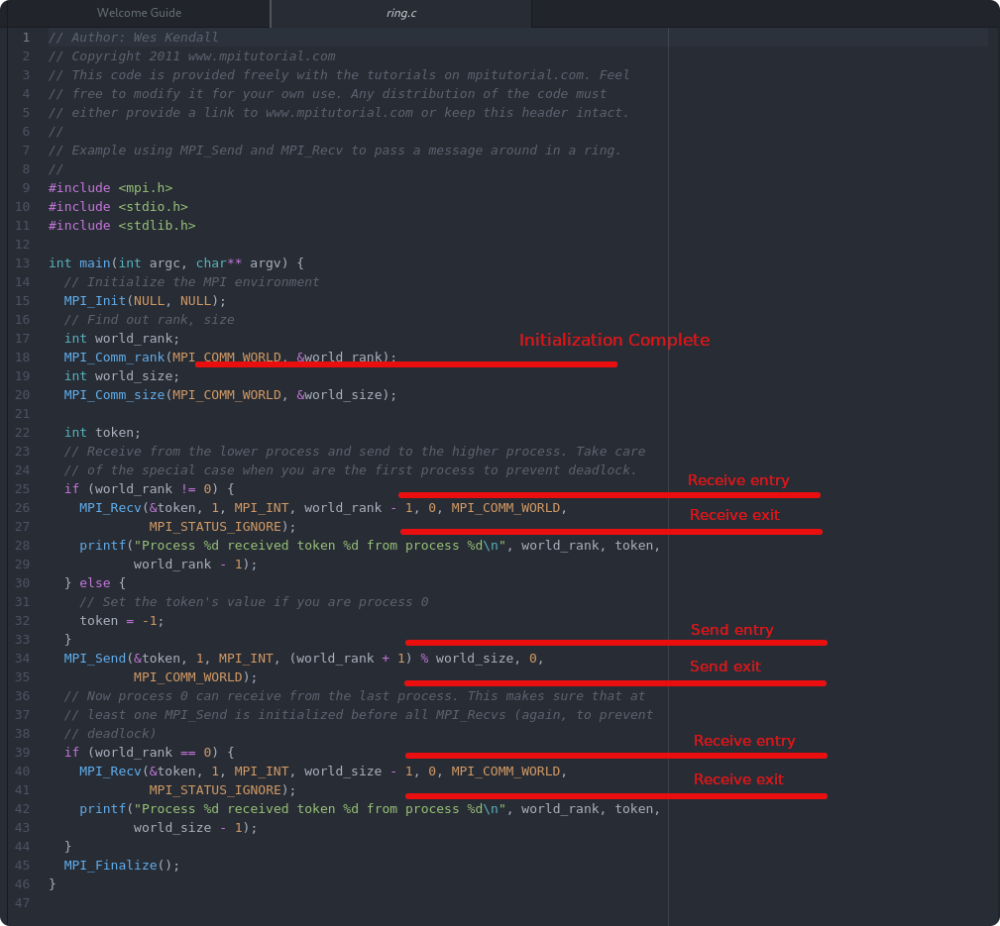

## Custom Userspace Instrumentation of C/C++ Applications

In this lab, you will learn how to instrument, compile and trace your own application using LTTng userspace instrumentation. We'll instrument a simple C MPI application doing message passing between threads.

*Pre-requisites*: Have Trace Compass installed and opened. Have lttng-ust installed, most notably the `liblttng-ust-dev` package. You can follow the [Install LTTng on Ubuntu](../001-instal-lttng-on-ubuntu/) lab or read the [LTTng web site](http://lttng.org) for more information.

*Note*: If you do not want to instrument the application and go straight to the analysis part for custom traces, you can directly go to the [scripted analysis for custom instrumentation](../204-scripted-analysis-for-custom-instrumentation) lab and use the trace provided with this tutorial.

- - -

### Task 1: Understand The MPI Application To Trace

For this lab, we'll instrument an MPI application, taken from the [MPI tutorial](https://mpitutorial.com/) examples. We'll instrument the `ring` application, in which one mpi worker sends a value to the next and so on until the value comes back to the first worker. The subset of files used for this lab, original and instrumented, are in the [code](code/) directory of this lab. To compile and run it, you'll need the `openmpi` development package (in Ubuntu, `sudo apt install mpi-default-dev`). A trace of the application is also available in the trace archive that comes with this tutorial.

```bash
$ git clone https://github.com/wesleykendall/mpitutorial.git
$ cd mpitutorial/tutorials/mpi-send-and-receive/code
```

The file to instrument will be the *ring.c* file. For more information on instrumenting applications, you can read the [complete documentation for instrumenting C/C++ applications with LTTng](https://lttng.org/docs/v2.10/#doc-c-application).

If we look at the [original ring.c](code/ring.orig.c) file, we can identify locations to instrument. We should instrument the following locations:

* After initialization: that's were we get the ID of the current MPI thread, so we will add the world_rank as a field.
* Before and after reception: We can identify the time spent waiting for a message. After the reception, we'll add the source of the message as a field.
* Before and after sending: To identify when we send the message to another worker. Before the send, we'll add the destination of the message as a field.



- - -

### Task 2: Define The Tracepoint Provider Files

The first step to instrument is to add the *tracepoint provider header file* that we will name `ring_tp.h`. This file contains the tracepoint definitions for all the tracepoints we'll insert. That's where we define their names, the fields to add and their types, etc.

```C
#undef TRACEPOINT_PROVIDER
#define TRACEPOINT_PROVIDER ring

#undef TRACEPOINT_INCLUDE
#define TRACEPOINT_INCLUDE "./ring_tp.h"

#if !defined(_RING_TP_H) || defined(TRACEPOINT_HEADER_MULTI_READ)
#define _TP_H

#include <lttng/tracepoint.h>

/* An event */
TRACEPOINT_EVENT(
    /* Tracepoint provider name */
    ring,
    /* Tracepoint class name */
    init,
    /* Input arguments */
    TP_ARGS(
        int, worker_id
    ),
    /* Output event fields */
    TP_FIELDS(
        ctf_integer(int, worker_id, worker_id)
    )
)

TRACEPOINT_EVENT(
    ring,
    recv_exit,
    TP_ARGS(
        int, worker_id
    ),
    TP_FIELDS(
        ctf_integer(int, source, worker_id)
    )
)

TRACEPOINT_EVENT(
    ring,
    send_entry,
    TP_ARGS(
        int, worker_id
    ),
    TP_FIELDS(
        ctf_integer(int, dest, worker_id)
    )
)

/* The tracepoint class */
TRACEPOINT_EVENT_CLASS(
    /* Tracepoint provider name */
    ring,
    /* Tracepoint class name */
    no_field,
    /* Input arguments */
    TP_ARGS(

    ),
    /* Output event fields */
    TP_FIELDS(

    )
)

/* Trace point instance of the no_field class */
TRACEPOINT_EVENT_INSTANCE(
    ring,
    no_field,
    recv_entry,
    TP_ARGS(

    )
)

TRACEPOINT_EVENT_INSTANCE(
    ring,
    no_field,
    send_exit,
    TP_ARGS(

    )
)

#endif /* _RING_TP_H */

#include <lttng/tracepoint-event.h>
```

Then we need to create the *tracepoint provider package source file*, which is a C source file that includes the *tracepoint provider header file* described above and is used to expand the tracepoint definition macros. That file will be named `ring_tp.c` and contains the simple following code:

```C
#define TRACEPOINT_CREATE_PROBES

#include "ring_tp.h"
```

Now we are ready to instrument the application itself.

- - -

### Task 3: Instrument The Application

To instrument the application, you should use the `tracepoint()` macro in the source code, with parameters that match the tracepoint definition. So to match the recv_exit tracepoint described above, the `tracepoint(ring, recv_exit, sourceId)` should be entered.

But you first need to include the tracepoint definition file and make sure the macros are expanded. The following lines should be added at the beginning of the file.

```C
#define TRACEPOINT_DEFINE
#include "ring_tp.h"
```

The code block below shows the diff between the original MPI ring application, and the instrumented one, with tracepoints inserted at the locations determined before. The [complete instrumented source file](code/ring.c) is available in the [code directory](code/).

```diff
@@ -10,12 +10,16 @@
 #include <stdio.h>
 #include <stdlib.h>

+#define TRACEPOINT_DEFINE
+#include "ring_tp.h"
+
 int main(int argc, char** argv) {
   // Initialize the MPI environment
   MPI_Init(NULL, NULL);
   // Find out rank, size
   int world_rank;
   MPI_Comm_rank(MPI_COMM_WORLD, &world_rank);
+  tracepoint(ring, init, world_rank);
   int world_size;
   MPI_Comm_size(MPI_COMM_WORLD, &world_size);

@@ -23,22 +27,28 @@ int main(int argc, char** argv) {
  // Receive from the lower process and send to the higher process. Take care
  // of the special case when you are the first process to prevent deadlock.
  if (world_rank != 0) {
+    tracepoint(ring, recv_entry);
     MPI_Recv(&token, 1, MPI_INT, world_rank - 1, 0, MPI_COMM_WORLD,
              MPI_STATUS_IGNORE);
+    tracepoint(ring, recv_exit, world_rank - 1);
     printf("Process %d received token %d from process %d\n", world_rank, token,
            world_rank - 1);
   } else {
     // Set the token's value if you are process 0
     token = -1;
   }
+  tracepoint(ring, send_entry, (world_rank + 1) % world_size);
   MPI_Send(&token, 1, MPI_INT, (world_rank + 1) % world_size, 0,
            MPI_COMM_WORLD);
+  tracepoint(ring, send_exit);
   // Now process 0 can receive from the last process. This makes sure that at
   // least one MPI_Send is initialized before all MPI_Recvs (again, to prevent
   // deadlock)
   if (world_rank == 0) {
+    tracepoint(ring, recv_entry);
     MPI_Recv(&token, 1, MPI_INT, world_size - 1, 0, MPI_COMM_WORLD,
              MPI_STATUS_IGNORE);
+    tracepoint(ring, recv_exit, world_size - 1);
     printf("Process %d received token %d from process %d\n", world_rank, token,
            world_size - 1);
   }
```

- - -

### Task 4: Compile The Application

The next step is to build the application with the tracepoints, using the `lttng-ust` libraries. There are many ways to compile and link an application with tracepoints: tracepoints can be statically linked with the instrumented application, or tracepoints can be compiled in a shared object, then linked with the application, or preloaded at compile time, etc. The LTTng documentation describes an [exhaustive list of compile and link scenarios](https://lttng.org/docs/v2.10/#doc-building-tracepoint-providers-and-user-application) for instrumented application.

For this lab, we'll present the simplest one: statically linking the tracepoints with the application.

We should compile the `ring.c` file along with the tracepoint provider package source file and linking with the lttng-ust library flag.

```bash
$ mpicc -o ring -I. ring_tp.c ring.c -llttng-ust -ldl
```

The `ring` application is now instrumented with static LTTng tracepoints. The application can be run as usual and the tracepoints, when not traced, should have a near zero overhead.

```bash
$ mpirun -N 4 ./ring
Process 1 received token -1 from process 0
Process 2 received token -1 from process 1
Process 3 received token -1 from process 2
Process 0 received token -1 from process 3
```

The following block shows the difference between the [original simple `makefile`](code/makefile.orig) and the [`makefile` for static linkage](code/makefile) of tracepoint code.

```diff
@@ -4,7 +4,7 @@ MPICC?=mpicc
 all: ${EXECS}

 ring: ring.c
-       ${MPICC} -o ring ring.c
+       ${MPICC} -o ring -I. ring_tp.c ring.c -llttng-ust -ldl

 clean:
        rm -f ${EXECS}
```

- - -

### Task 5: Trace an Instrumented Application

To trace an application instrumented with LTTng-UST tracepoints, one simply needs to create a tracing session, enable the userspace events corresponding to the **ring** tracepoint provider, start tracing and run the application.

Since we are tracing userspace only, we add the `vtid` context, to differentiate the running thread. This context wouldn't be necessary if there was a kernel trace taken at the same time.

```bash
$ lttng create
Session auto-20191015-113432 created.
Traces will be output to /home/user/lttng-traces/auto-20191015-113432
$ lttng enable-event -u 'ring:*'
UST event ring:* created in channel channel0
$ lttng add-context -u -t vtid
UST context vtid added to all channels
$ lttng start
Tracing started for session auto-20191015-113432
$ mpirun -N 4 ./ring
Process 1 received token -1 from process 0
Process 2 received token -1 from process 1
Process 3 received token -1 from process 2
Process 0 received token -1 from process 3
$ lttng stop
Waiting for destruction of session "auto-20191015-113432"...
Tracing stopped for session "auto-20191015-113432"
$ lttng view
Trace directory: /home/user/lttng-traces/auto-20191015-113432

[... trace output]
$ lttng destroy
Session "auto-20191015-113432" destroyed
```

The trace is available in the `/home/user/lttng-traces/auto-20191015-113432`, typically in a `ust/uid/<user uid>/64-bit` sub-directory. It can now be opened in visualization tools like Trace Compass.

- - -

### Conclusion

In the lab, you have instrumented and compiled a simple MPI application, with LTTng userspace instrumentation. You also obtained a trace from this application execution. But the events in the trace are of type that is not understood by default by the trace viewers. They can be counted, one can manually follow the execution of the application, but hardly any analysis can be made out of the box. In the next lab, we'll see how we can visualize those custom traces.

- - -

#### Next

* [Script Analyzes For Custom Instrumentation](../204-scripted-analysis-for-custom-instrumentation) to see how we can analyze and observe traces with custom instrumentation
or
* [Back](../) for more options
