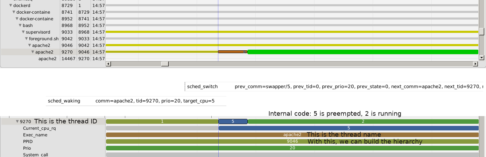

## Introduction to Language Specific Tracing

So far in this tutorial, we have seen how to trace the system or applications using tools and tracepoints that are built into the operating system (linux kernel system tracing) or the tracers (LTTng userspace tracing). Now this section introduces common concepts for language specific tracing. Additional labs will cover each language individually: how to trace and what can be traced.

*Pre-requisites*: You should by now be familiar with Trace Compass navigation. If not, you can follow the [kernel trace navigation](../101-trace-navigation-in-tracecompass) lab, which covers basic navigation and concepts used also for userspace.

- - -

### Task 1: Understanding How Analyses Are Made And Stored

Since each application to trace will have their own tracepoints that are not known to Trace Compass, there will of course be no builtin analysis specific for this application. Application developers will thus have to build their own.

One way to do that is to get the source code of Trace Compass and write some Java code. While feasible and [documented](http://archive.eclipse.org/tracecompass/doc/org.eclipse.tracecompass.doc.dev/Analysis-Framework.html#Analysis_Framework), this is harder to do and has a setup overhead that may not be required for analyses.

Trace Compass has a feature called [data driven analyses](http://archive.eclipse.org/tracecompass/doc/stable/org.eclipse.tracecompass.doc.user/Data-driven-analysis.html#Data_driven_analysis) that allows users to write their own analyses, using XML language. That should be the first thing to try with custom events.

But first, we need to understand what analyses do and how they store their results.

#### Task 1.1: Understanding the State System

One type of analysis that can be done with traces is to follow objects, like processes, CPUs, tasks, etc, through the trace. Objects may have various properties to track, or execution/call stacks, that change through time. This type of data is stored in a *state system*.

A *state system* is one of the backends used to store results in Trace Compass. It stores the states of different elements in time. The best way to describe the state system is with its direct visual representation: the time graph view.

Like the time graph view, the state system has elements, grouped hierarchically, as necessary. And each element has states. Whenever the value of a state changes because of an given event, the old state is stored as an interval that goes from the last state change to the time of the current event, and the current state is updated and will be valid until another event causes the next state change for this element.

Time graph views will be beautified representation of the raw analysis data stored in the state system.

The following example shows a line in the `Control Flow` view, representing the states of the `apache2`  process, along with its corresponding line in the state system. We also show what events caused which state change to happen. The `Control Flow` view is one view where a lot of effort was put, so between the state system and the view are quite a few manipulations. But most userspace analyses can go directly from state system to time graph, without other processing, or at least, that is the easy way to do.



In the next tasks of this lab, we will explain how to describe such state changes using XML.

#### Task 1.2: Understanding the Latency Store

Another typical analysis made from traces is to calculate various execution latencies. For example, in the kernel, we have system call latencies, IRQ handlers latencies, etc. In userspace, it can be request latencies, network latencies. While the state system could store this data as well, Trace Compass has another backend for it called *Segment Store*.

The *segment stores* implement a Collection, each segment is independant from the other ones, though they can have attributes from which we can know that they belong to or involve the same elements. Each individual execution latency is called a segment. It has a beginning, an end, and thus a duration. And any other user-defined property.

From a segment store, all 4 latency views are available: statistics, scatter plot vs time, density (histograms) and individual latencies.

#### Task 1.3: Understanding the CallStack

Sometimes, analysis data can be represented in the form of a *callstack*, ie any nested pieces of execution that can be related to a same element.

With callstack, the available views are the flame chart, flame graph, call tree, histogram and statistics.

In the backend, the callstacks are simple state systems with a structure such that an element may have a child element called *CallStack* under which are elements numbered 1 to n that contain the status of the stack at the corresponding level. So callstacks are built exactly like a state system. A higher level XML element will define how to transform the elements of the state system into a hierarchy of elements under which there is a CallStack.

The following section should clarify how to build those analyses using XML.

- - -

### Task 2: Writing A State Analysis

- - -

### Task 3: Writing The View For The States

- - -

### Task 4: Writing A Latency Analysis

- - -

### Task 5: Writing A CallStack Analysis

A small explanation on how to write a stack trace xml analysis will be provided here however the documentation on how to write an XML analysis is available in the [Trace Compass user documentation](http://archive.eclipse.org/tracecompass/doc/stable/org.eclipse.tracecompass.doc.user/Data-driven-analysis.html#Data_driven_analysis).

The XML analysis is used to generate a state system which can track the states of different elements over the duration of a trace using the different events and their properties.
An empty file, with no content yet would look like this:
```XML
<?xml version="1.0" encoding="UTF-8"?>
<tmfxml xmlns:xsi="http://www.w3.org/2001/XMLSchema-instance"
    xsi:noNamespaceSchemaLocation="xmlDefinition.xsd">
    [...]
</tmfxml>
```

In our case we want a `callstack` which has two elements:
* The `callstackGroup` have metadata telling where in the state system, the callstack state will be stored.
* The `pattern` is the xml element telling Trace Compass how to parse a pattern of trace events in order to build one or multiple state machines. These state machines are used to gain state information of a process, thread or program, from the events.

```XML
<callstack id="lttng.ust.pythonRequest.analysis">
    <callstackGroup name="Python threads">
        <level path="Threads/*"/>
        <thread cpu="cpu"/>
    </callstackGroup>
    <pattern version="1" id="ca.polymtl.pythonrequest">
        [...]
    </pattern>
</callstack>
```

In the pattern element we have 3 elements:
* The `head` which contains the traceType that tells Trace Compass which trace type this analysis applies to, in this case this analysis applies to ust traces. The label indicates the name under which the views will be displayed in the project explorer.
* The `location` elements are shortcuts indicates how each thread state is displayed in the views. Locations can be referenced by state attributes or state values.
* The `patternHandler` is where `test`, `action` and `fsm` elements will be defined.
```XML
<head>
    <traceType id="org.eclipse.linuxtools.lttng2.ust.tracetype"/>
    <label value="Python Requests View"/>
</head>

<location id="CurrentThread">
    <stateAttribute type="constant" value="Threads"/>
    <stateAttribute type="query">
        <stateAttribute type="constant" value="#CurrentScenario"/>
        <stateAttribute type="constant" value="threadName"/>
    </stateAttribute>
</location>

<patternHandler>
    [...]
</patternHandler>
```
The `patternHandler` element is where the core of the logic is defined, details about each element are available in [Writing the XML pattern provider](http://archive.eclipse.org/tracecompass/doc/stable/org.eclipse.tracecompass.doc.user/Data-driven-analysis.html#Writing_the_XML_pattern_provider).

* The `test` element defines a condition used in the state machine to execute a transition.
* The `action` element defines a change in the state or a segment generation to apply when there is a transition.
* The `fsm` element defines the states and their transitions.

```XML
<test id="same_thread"> [...] </test>
<test id="new_request"> [...] </test>
<test id="end_request"> [...] </test>

<action id="entering_thread"> [...] </action>
<action id="push_event_type"> [...] </action>
<action id="pop_event_type"> [...] </action>

<fsm id="pythonRequest" initial="Wait_start"> [...] </fsm>
```

Here is the XML that defines the finite state machine (FSM). In this case a request has three states for a server processing it: not started, being processed, finished. These states are respectively `Wait_start`, `in_thread` and `end_thread`. Each state can have transitions to other states and these transitions have conditions in order to parse the trace adequately. They also have an action to execute when the transition happen.
```XML
<fsm id="pythonRequest" initial="Wait_start">
    <state id="Wait_start">
        <transition event="*" cond="new_request" target="in_thread" action="entering_thread:push_event_type"/>
    </state>
    <state id="in_thread" >
        <transition event="*" cond="same_thread:end_request" target="end_thread" action="pop_event_type"/>
    </state>
    <final id="end_thread"/>
</fsm>
```

- - -

### References

Here are some userspace tracing information that would deserve their own lab in this tutorial:

* [Instrumenting C/C++ applications](https://lttng.org/docs/v2.10/#doc-c-application)
* [Tracing Java with LTTng with log handlers for JUL and Log4J](https://lttng.org/docs/v2.10/#doc-java-application)
* [Tracing .NET Core on Linux with LTTng](http://tooslowexception.com/analyzing-runtime-coreclr-events-from-linux-trace-compass/) blog post from a Trace Compass User.

- - -

#### Next:

* [Python tracing](../204-tracing-python)
or
* [PHP function tracing](../205-tracing-php-userspace)
or
* [Back](../) for more options
