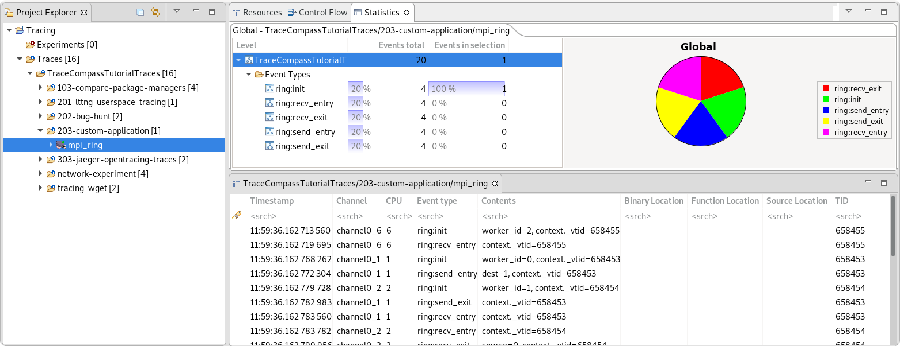
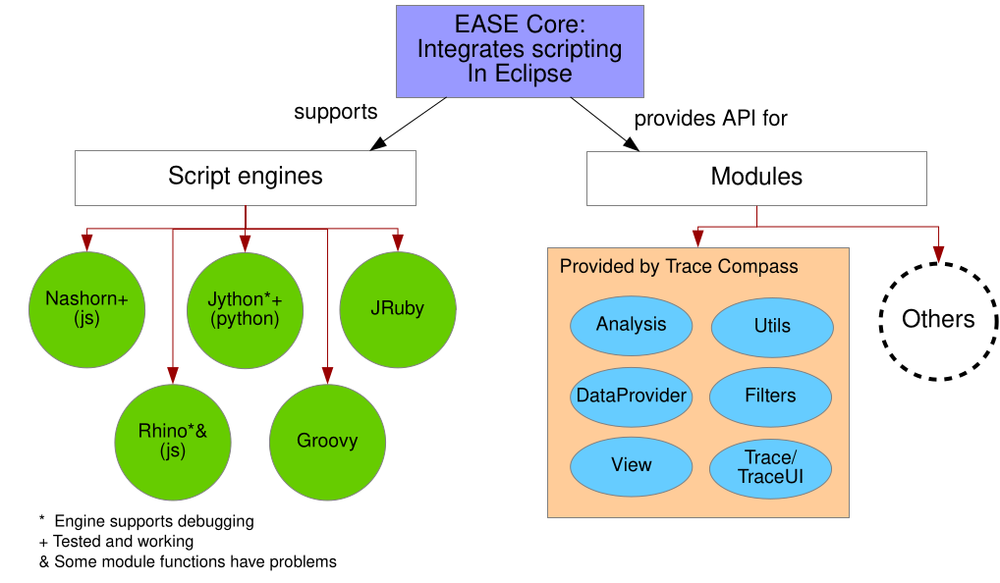
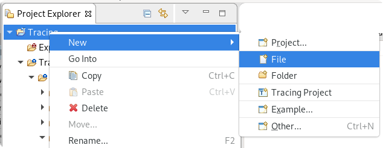
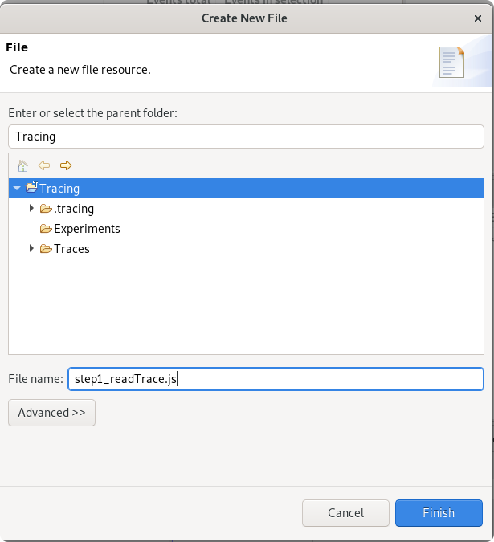
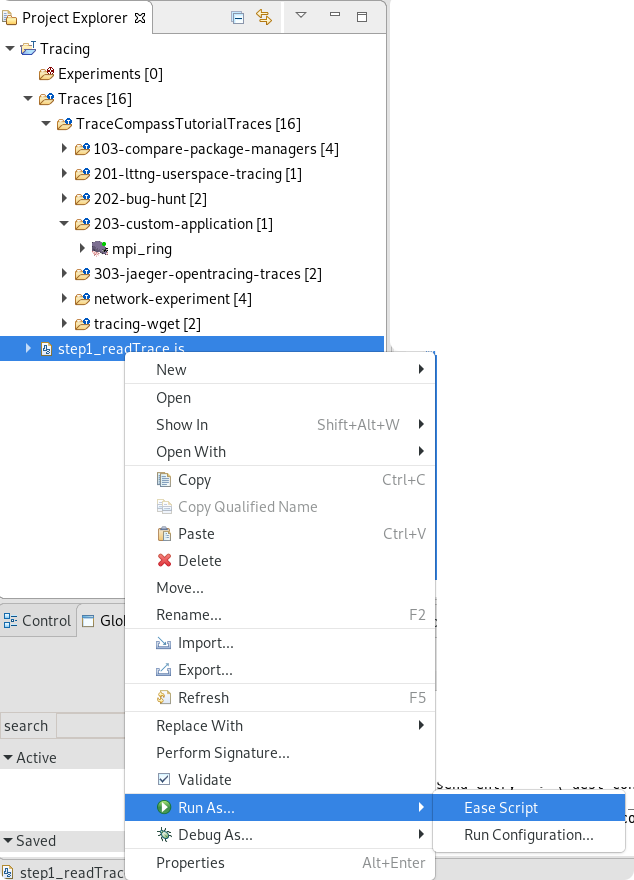
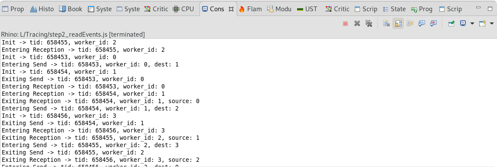
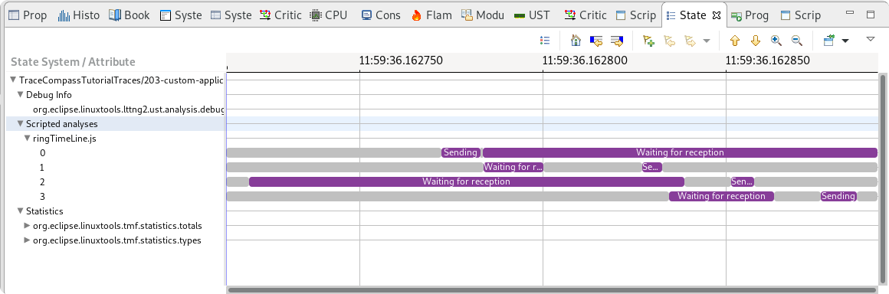
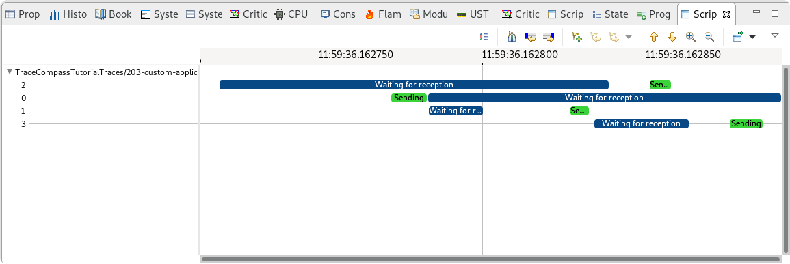
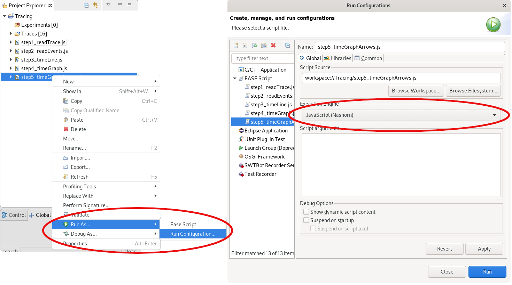
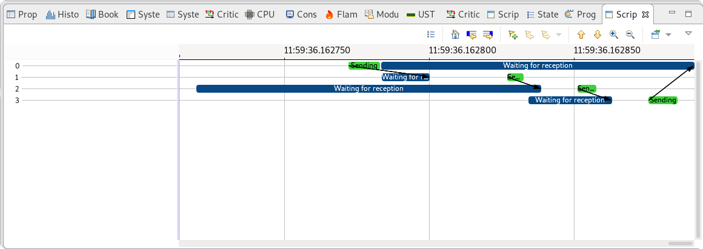

## Custom Userspace Tracing And Scripted Analyzes

In this lab, you will learn how we can visualize traces that contain custom events. We'll see how we can develop scripted analyzes and obtain meaningful views from custom trace points.  This features uses the [`EASE Framework`](https://www.eclipse.org/ease/) from Eclipse. Scripting can be used with any trace or experiment that can be opened with Trace Compass.

*Pre-requisites*: Have Trace Compass installed and opened. Have the Trace Compass Scripting Javascript add-on installed. You can follow the [Installing TraceCompass](../006-installing-tracecompass/) lab or read the [TraceCompass web site](http://tracecompass.org) for more information.

- - -

### Task 1: Open the trace in Trace Compass

Let's open the trace that was obtained from the previous lab, with custom events. Or, if using the trace archive the `203-custom-application/mpi_ring` trace.

We see that the only analysis really available for that trace is the `Statistics` analysis. To have more, we will have to script them, using javascript.



- - -

### Task 2: Installing the Scripting Plug-ins

You can install the *Open Tracing* trace type in *Tools* -> *Adds-on...*. Check the `Trace Compass Scripting (Incubation)` and `Trace Compass Scripting Javascript (Incubation)` feature and click *Finish*. Follow the instructions on screen.


- - -

### Task 3: Understand How EASE Scripting Works

EASE is a scripting environment for Eclipse, which allows to run code in the context of the running Java/Eclipse instance. In practice, that means it can run any script of a particular language (for eg. any python script can be run through EASE), plus it adds ways to access Java code and methods directly and interact with the running application.

EASE, as a framework, allows applications, like Trace Compass, to write module classes that provide methods that can be directly called by a script once the module is loaded. Those methods are helper methods that give direct access to the application's inside. But if no helper method is available for a certain operation, the script still has access to all of the application's code and API, using the full path of classes! It is thus a very powerful feature that let users do almost anything they wish!

The following screenshot shows a schema of EASE, with the various engines and modules available.



- - -

### Task 4: Create A Script To Parse The Events

*For this lab, we'll write the analysis in javascript, but any of the supported languages would do.*

Let's first create the script file by right-clicking on the `Tracing` project, then selecting `New` -> `file`.



And creating a file named `step1_readTrace.js`.



The file should be opened and in focus in the Trace Compass window. For this first step, we will simply take the currently opened trace, which should be the custom trace, iterate through its events and print the event name and its fields in the `Console` view.

:exclamation: To see the various scripting modules available and the methods they provide, you can open the `Module Explorer` view, by using the `ctrl-3` shortcut and entering "Module Explorer", or clicking on the `Window` -> `Show View` menu and selecting the `Module Explorer` under the `Scripting` category.

You can copy-paste the following javascript code in the file. The code can be found [in the scripts directory](scripts/step1_readTrace.js).

```Javascript
// Load the proper modules
loadModule("/TraceCompass/Trace")

// Get the active trace
var trace = getActiveTrace()

// Get an event iterator on that trace
var iter = getEventIterator(trace)

// Iterate through the events
var event = null
while (iter.hasNext()) {
	event = iter.next()

	// For each event, print the name and the field names
	eventString = event.getName() + " --> ( "

	var fieldsIterator = event.getContent().getFieldNames().iterator()
	while (fieldsIterator.hasNext()) {
		eventString += fieldsIterator.next() + " "
	}
	eventString += ")"

	print(eventString);
}
```

To execute this file, we right-click on the file, select `Run As...` -> `Ease Script`.



The output will be displayed in the `Console View` as shown below.


- - -

### Task 5: Parse Events And Get Field Values

For this next task of the script, we'll add an if-then-else statement to the script for each of the `ring` events and print the field value for each event.

We'll also save the IDs of the various threads so we can match them with their worker later.

The following block shows the diff between the first reading of the trace and reading the event fields. The [full file for this step](scripts/step2_readEvents.js) can be found in the `scripts` directory.

```diff
@@ -11,20 +11,37 @@ var trace = getActiveTrace()

 // Get an event iterator on that trace
 var iter = getEventIterator(trace)
+// Associate a TID with an mpi worker
+var tidToWorkerMap = {};

 // Iterate through the events
 var event = null
 while (iter.hasNext()) {
        event = iter.next()

-       // For each event, print the name and the field names
-       eventString = event.getName() + " --> ( "
-
-       var fieldsIterator = event.getContent().getFieldNames().iterator()
-       while (fieldsIterator.hasNext()) {
-               eventString += fieldsIterator.next() + " "
+       eventName = event.getName()
+       if (eventName == "ring:init") {
+               tid = getEventFieldValue(event, "context._vtid")
+               worker_id = getEventFieldValue(event, "worker_id")
+               tidToWorkerMap[tid] = worker_id
+               print("Init -> tid: " + tid + ", worker_id: " + worker_id)
+       } else if (eventName == "ring:recv_entry") {
+               tid = getEventFieldValue(event, "context._vtid")
+               worker_id = tidToWorkerMap[tid]
+               print("Entering Reception -> tid: " + tid+ ", worker_id: " + worker_id)
+       } else if (eventName == "ring:recv_exit") {
+               tid = getEventFieldValue(event, "context._vtid")
+               worker_id = tidToWorkerMap[tid]
+               source = getEventFieldValue(event, "source")
+               print("Exiting Reception -> tid: " + tid + ", worker_id: " + worker_id + ", source: " + source)
+       } else if (eventName == "ring:send_entry") {
+               tid = getEventFieldValue(event, "context._vtid")
+               worker_id = tidToWorkerMap[tid]
+               dest = getEventFieldValue(event, "dest")
+               print("Entering Send -> tid: " + tid + ", worker_id: " + worker_id + ", dest: " + dest)
+       } else if (eventName == "ring:send_exit") {
+               tid = getEventFieldValue(event, "context._vtid")
+               worker_id = tidToWorkerMap[tid]
+               print("Exiting Send -> tid: " + tid + ", worker_id: " + worker_id)
        }
-       eventString += ")"
-
-       print(eventString);
 }
```

:grey_exclamation: Note that for the sake of understandability, we did not bother with validating that the field values are not `null`, but we should! There may have been lost events that prevented from getting the worker_id at initialization time, or the trace may have started later during the execution, etc.

Again, the output will be displayed in the `Console View` as shown below.



- - -

### Task 6: Draw a Time Line View For The Trace

What we have done so far is ouput data to the console. We would like to display our MPI workers' data in a view, so let's first save the data to view in the proper backend, that will be queried later by the view.

We identify 2 states for our threads: **Waiting for reception** or **Sending**. The events that enter and exit each states are respectively `ring:recv_entry` and `ring:recv_exit` for the **Waiting for reception** state and `ring:send_entry` and `ring:send_exit` for the **Sending** state.

#### Task 6.1: Understanding the State System

We'll save those states in a backend called a **State System**. It is like a database that stores the states of different elements through time. The best way to describe the state system is with its direct visual representation: the time graph view.

Like the time graph view, the state system has elements, possibly grouped hierarchically. And each element has states. Whenever the value of a state changes because of an given event, the old state is stored as an interval that goes from the last state change to the time of the current event, and the current state is updated and will be valid until another event causes the next state change for this element.

The content of the state system can be visualized with the `State System Explorer` view, opened by pressing `ctrl-3` and searching of `State System Explorer` or with `Window` -> `Show View` under `Tracing`.

#### Task 6.2: Write The Ring Analysis

Our ring analysis will be quite simple, we'll have one element for each of the thread, represented by its *worker_id* and the state changes for each one. In the previous task, we already recovered the `worker_id` fields, using the thread IDs and the `ring:init` event, so that for each event, using the thread ID, we can get the corresponding MPI worker ID.

But first, we need to retrieve the backend to which to save the data. We'll need a new scripting module: `/TraceCompass/Analysis`. The following snipet get an analysis and its state system from the active trace.

```javascript
loadModule("/TraceCompass/Trace")
loadModule("/TraceCompass/Analysis")

var trace = getActiveTrace()
var analysis = createScriptedAnalysis(trace, "ringTimeLine.js")
var ss = analysis.getStateSystem(false);
```

Next, to save the states for a state system element, we first need to retrieve the key for this element, the `quark`. The element is by a path in the element hierarchy, which should be unique. In this example, we'll use the worker ID as unique identifier, with only one level in the hierarchy, so

```Javascript
quark = ss.getQuarkAbsoluteAndAdd(worker_id);
```

Say we wanted to add a parent level in the hierarchy called *Workers*, we would retrieve the quark like this:

```Javascript
quark = ss.getQuarkAbsoluteAndAdd("Workers", worker_id);
```

Now, we can save the states for the element. State values are simple types: `String`, `integer`, `long` and the states can be `null`. For one element, only one type of states is possible, so if an `integer` state is saved first, then all subsequent states must be of `integer` type. The following lines save a `String` state value, then sets is back to `null` right after.

```Javascript
quark = ss.getQuarkAbsoluteAndAdd(worker_id);
ss.modifyAttribute(event.getTimestamp().toNanos(), "Waiting for reception", quark);
ss.removeAttribute(event.getTimestamp().toNanos(), quark);
```

The following block shows the diff between the script printing the event and the one writing to the state system. The [full file for this step](scripts/step3_stateSystem.js) can be found in the `scripts` directory.

```diff
@@ -5,6 +5,7 @@

 // Load the proper modules
 loadModule("/TraceCompass/Trace")
+loadModule("/TraceCompass/Analysis")

 // Get the active trace
 var trace = getActiveTrace()
@@ -14,6 +15,11 @@ var iter = getEventIterator(trace)
 // Associate a TID with an mpi worker
 var tidToWorkerMap = {};

+//Get an analysis
+var analysis = createScriptedAnalysis(trace, "ringTimeLine.js")
+// Get the analysis's state system so we can fill it, false indicates to create a new state system even if one already exists
+var ss = analysis.getStateSystem(false);
+
 // Iterate through the events
 var event = null
 while (iter.hasNext()) {
@@ -24,24 +30,36 @@ while (iter.hasNext()) {
               tid = getEventFieldValue(event, "context._vtid")
               worker_id = getEventFieldValue(event, "worker_id")
               tidToWorkerMap[tid] = worker_id
-               print("Init -> tid: " + tid + ", worker_id: " + worker_id)
       } else if (eventName == "ring:recv_entry") {
               tid = getEventFieldValue(event, "context._vtid")
               worker_id = tidToWorkerMap[tid]
-               print("Entering Reception -> tid: " + tid+ ", worker_id: " + worker_id)
+               // Save the state of the resource as waiting for reception
+               quark = ss.getQuarkAbsoluteAndAdd(worker_id);
+               ss.modifyAttribute(event.getTimestamp().toNanos(), "Waiting for reception", quark);
       } else if (eventName == "ring:recv_exit") {
               tid = getEventFieldValue(event, "context._vtid")
               worker_id = tidToWorkerMap[tid]
               source = getEventFieldValue(event, "source")
-               print("Exiting Reception -> tid: " + tid + ", worker_id: " + worker_id + ", source: " + source)
+               // Remove the waiting for reception state
+               quark = ss.getQuarkAbsoluteAndAdd(worker_id);
+               ss.removeAttribute(event.getTimestamp().toNanos(), quark);
       } else if (eventName == "ring:send_entry") {
               tid = getEventFieldValue(event, "context._vtid")
               worker_id = tidToWorkerMap[tid]
               dest = getEventFieldValue(event, "dest")
-               print("Entering Send -> tid: " + tid + ", worker_id: " + worker_id + ", dest: " + dest)
+               // Save the state of the resource as sending
+               quark = ss.getQuarkAbsoluteAndAdd(worker_id);
+               ss.modifyAttribute(event.getTimestamp().toNanos(), "Sending", quark);
} else if (eventName == "ring:send_exit") {
        tid = getEventFieldValue(event, "context._vtid")
        worker_id = tidToWorkerMap[tid]
-               print("Exiting Send -> tid: " + tid + ", worker_id: " + worker_id)
+               // Remove the sending for reception state
+               quark = ss.getQuarkAbsoluteAndAdd(worker_id);
+               ss.removeAttribute(event.getTimestamp().toNanos(), quark);
}
}
+
+// Done parsing the events, close the state system at the time of the last event, it needs to be done manually otherwise the state system will still be waiting for values and will not be considered finished building
+if (event != null) {
+       ss.closeHistory(event.getTimestamp().toNanos());
+}
```

:exclamation: Notice the last lines of this diff, which closes the state system. It is important to close the state system, as it tells Trace Compass that the analysis is finished. Otherwise, the analysis will be shown as "in progress" forever!

```javascript
if (event != null) {
       ss.closeHistory(event.getTimestamp().toNanos());
}
```

At this point, one way to view the data (and a way to debug the content of the state system in general) is the use the `State System Explorer` view, as seen in the screenshot below.



- - -

### Task 7: Draw a Time Graph View For The Trace

Now that we have the state system, we can display it in a time graph view. To do this, we'll need 2 new scripting modules: `/TraceCompass/DataProvider` and `/TraceCompass/View`.

The data provider is a way to describe the data to display: the elements and the states. An easy way to define a data provider is simply to provide the paths in the state system of the elements to display. In our case, it will be quite straightforward.

```Javascript
var map = new java.util.HashMap();
map.put(ENTRY_PATH, '*');
provider = createTimeGraphProvider(analysis, map);
```

Then, to open a view, one simply needs to send the provider to the `openTimeGraphView` method:

```Javascript
openTimeGraphView(provider);
```

The following block shows the diff required to add the time graph display to the previous state system analysis. The [full file for this step](scripts/step4_timeLine.js) can be found in the `scripts` directory.

```diff
@@ -6,6 +6,8 @@
 // Load the proper modules
 loadModule("/TraceCompass/Trace")
 loadModule("/TraceCompass/Analysis")
+loadModule("/TraceCompass/DataProvider")
+loadModule("/TraceCompass/View")

 // Get the active trace
 var trace = getActiveTrace()
@@ -63,3 +65,13 @@ while (iter.hasNext()) {
 if (event != null) {
        ss.closeHistory(event.getTimestamp().toNanos());
 }
+
+//Get a time graph provider from this analysis, displaying all attributes
+//Create a map and fill it, because javascript map cannot use the EASE constants as keys
+var map = new java.util.HashMap();
+map.put(ENTRY_PATH, '*');
+provider = createTimeGraphProvider(analysis, map);
+if (provider != null) {
+       // Open a time graph view displaying this provider
+       openTimeGraphView(provider);
+}

```

After executing the script, a new view will open, the `Scripted Time Graph` view, that will nicely show the states of the MPI workers.



- - -

### Task 8: Add Arrows To The Time Graph View

The view we have here is rather small and obvious, but more workers and/or a more complex use case may quickly make it less readable. Since we are passing messages between threads, it would be helpful to see the message being passed around, with arrows in the time graph.

This functionality is supported in the scripted time graph view. To do this though, since the state system does not provision for defining arrows directly, our script will have to create the arrows itself. And since arrows are from an entry to another, the easiest way is to also define the entries in the script. The states, on the other hand, can come automatically from the entries' quark.

We will define an arrow as starting from the `ring:send_entry` event, using the `dest` field as the value for the destination. The arrow will be completed when the MPI worker with rank `dest` hits the `mpi:recv_exit` event where the `source` field is the thread who sent the message.

Upon sending, we'll save a pending arrow for destination:

```javascript
pendingArrows[dest] = {"time" : event.getTimestamp().toNanos(), "source" : worker_id, "dest" : dest};
```

Upon receiving, we'll complete the arrow and add it to a list of completed arrows:

```Javascript
pending = pendingArrows[worker_id];
if (pending != null) {
	pendingArrows[worker_id] = null;
	pending["endTime"] = event.getTimestamp().toNanos();
	arrows.push(pending);
}
```

At the end of the analyses, we can create the entries, sort them numerically and add them to a Java list that will be returned to the data provider later.

```Javascript
var tgEntries = createListWrapper();
quarks = ss.getQuarks("*");
var mpiEntries = [];
for (i = 0; i < quarks.size(); i++) {
	quark = quarks.get(i);
	mpiWorkerId = ss.getAttributeName(quark);
	entry = createEntry(mpiWorkerId, {'quark' : quark});
	mpiWorkerToId[mpiWorkerId] = entry.getId();
	mpiEntries.push(entry);
}
mpiEntries.sort(function(a,b){return Number(a.getName()) - Number(b.getName())});
for (i = 0; i < mpiEntries.length; i++) {
	tgEntries.getList().add(mpiEntries[i]);
}
```

As for the arrows, they can also be constructed and added to a list once we have created the entries and matched their names to an entry ID

```Javascript
for (i=0; i < arrows.length; i++) {
	arrow = arrows[i];
	srcId = mpiWorkerToId[arrow["source"]];
	dstId = mpiWorkerToId[arrow["dest"]];
	startTime = arrow["time"];
	duration = arrow["endTime"] - startTime;
	tgArrows.getList().add(createArrow(srcId, dstId, startTime, duration, 1));
}
```

As with the previous time graph without arrows, the time graph that includes arrows requires to have a data provider, which, this time, will be defined using Java functions that take the data provider's request parameters as input and return the data of the proper type: entries or arrows. In javascript, it is quite simple, as a javascript function will be converted directly in to a Java Function.

```Javascript
function getEntries(parameters) {
	return tgEntries.getList();
}

function getArrows(parameters) {
	return tgArrows.getList();
}
```

The data provider creation method then only refers to those functions as follows, where the null could be a function that returns the states for each entry. That function would be quite more complex to script and since entries are directly mapped to an element (quark) of the state system, by setting it to `null`, it only tells to use the quark of the entry as the source of state values.

```Javascript
provider = createScriptedTimeGraphProvider(analysis, getEntries, null, getArrows);
```

The following diff block shows the changes needed to the script to add support of arrows. The [full file for this step](scripts/step5_timeGraphArrow.js) can be found in the `scripts` directory.

```diff
@@ -8,6 +8,7 @@ loadModule("/TraceCompass/Trace")
 loadModule("/TraceCompass/Analysis")
 loadModule("/TraceCompass/DataProvider")
 loadModule("/TraceCompass/View")
+loadModule('/TraceCompass/Utils');

 // Get the active trace
 var trace = getActiveTrace()
@@ -22,6 +23,11 @@ var analysis = createScriptedAnalysis(trace, "ringTimeLine.js")
 // Get the analysis's state system so we can fill it, false indicates to create a new state system even if one already exists
 var ss = analysis.getStateSystem(false);

+//Save information on the pending arrows
+var pendingArrows = {};
+//Variable to save the arrow information
+var arrows = [];
+
 // Iterate through the events
 var event = null
 while (iter.hasNext()) {
@@ -45,6 +51,15 @@ while (iter.hasNext()) {
               // Remove the waiting for reception state
               quark = ss.getQuarkAbsoluteAndAdd(worker_id);
               ss.removeAttribute(event.getTimestamp().toNanos(), quark);
+               // Complete an arrow if the start was available
+               pending = pendingArrows[worker_id];
+               if (pending != null) {
+                       // There is a pending arrow (ie send) for this message
+                       pendingArrows[worker_id] = null;
+                       pending["endTime"] = event.getTimestamp().toNanos();
+                       arrows.push(pending);
+               }
+
       } else if (eventName == "ring:send_entry") {
               tid = getEventFieldValue(event, "context._vtid")
               worker_id = tidToWorkerMap[tid]
@@ -52,6 +67,9 @@ while (iter.hasNext()) {
               // Save the state of the resource as sending
               quark = ss.getQuarkAbsoluteAndAdd(worker_id);
               ss.modifyAttribute(event.getTimestamp().toNanos(), "Sending", quark);
+
+               // Save a pending arrow
+               pendingArrows[dest] = {"time" : event.getTimestamp().toNanos(), "source" : worker_id, "dest" : dest};
       } else if (eventName == "ring:send_exit") {
               tid = getEventFieldValue(event, "context._vtid")
               worker_id = tidToWorkerMap[tid]
@@ -66,11 +84,63 @@ if (event != null) {
       ss.closeHistory(event.getTimestamp().toNanos());
}

-//Get a time graph provider from this analysis, displaying all attributes
-//Create a map and fill it, because javascript map cannot use the EASE constants as keys
-var map = new java.util.HashMap();
-map.put(ENTRY_PATH, '*');
-provider = createTimeGraphProvider(analysis, map);
+// Get list wrappers from Trace Compass for the entries and arrows. The conversion between javascript list and java list is not direct, so we need a wrapper
+var tgEntries = createListWrapper();
+var tgArrows = createListWrapper();
+
+/* Prepare the time graph data, there is few enough entries and arrows that it can be done once and returned once */
+
+// Map the worker ID to an entry ID
+var mpiWorkerToId = {};
+
+// Get all the quarks of the entries
+quarks = ss.getQuarks("*");
+// Prepare the entries
+var mpiEntries = [];
+for (i = 0; i < quarks.size(); i++) {
+       quark = quarks.get(i);
+       // Get the mpi worker ID, and find its quark
+       mpiWorkerId = ss.getAttributeName(quark);
+       // Create an entry with the worker ID as name and the quark. The quark will be used to populate the entry's data.
+       entry = createEntry(mpiWorkerId, {'quark' : quark});
+       mpiWorkerToId[mpiWorkerId] = entry.getId();
+       mpiEntries.push(entry);
+}
+// Sort the entries numerically
+mpiEntries.sort(function(a,b){return Number(a.getName()) - Number(b.getName())});
+// Add the entries to the entry list
+for (i = 0; i < mpiEntries.length; i++) {
+       tgEntries.getList().add(mpiEntries[i]);
+}
+
+// Prepare the arrows
+for (i=0; i < arrows.length; i++) {
+       arrow = arrows[i];
+
+       // For each arrow, we get the source and destination entry ID from its mpi worker ID
+       srcId = mpiWorkerToId[arrow["source"]];
+       dstId = mpiWorkerToId[arrow["dest"]];
+       // Get the start time and calculate the duration
+       startTime = arrow["time"];
+       duration = arrow["endTime"] - startTime;
+       // Add the arrow to the arrows list
+       tgArrows.getList().add(createArrow(srcId, dstId, startTime, duration, 1));
+}
+
+// A function used to return the entries to the data provider. It receives the filter in parameter, which contains the requested time range and any additional information
+function getEntries(parameters) {
+       // The list is static once built, return all entries
+       return tgEntries.getList();
+}
+
+// A function used to return the arrows to the data provider. It receives the filter in parameter, which contains the requested time range and any additional information
+function getArrows(parameters) {
+       // Just return all the arrows, the view will take those in the range
+       return tgArrows.getList();
+}
+
+// Create a scripted data provider for this analysis, using script functions to get the entries, row model data and arrows. Since the entries have a quark associated with them which contains the data to display, there is no need for a scripted getRowData function, so we send null
+provider = createScriptedTimeGraphProvider(analysis, getEntries, null, getArrows);
 if (provider != null) {
			 // Open a time graph view displaying this provider
			 openTimeGraphView(provider);
```

You can now execute the scripts as usual.

:grey_question: Running this script may cause an exception saying `org.eclipse.ease.ScriptExecutionException: SyntaxError: Cannot convert * to java.lang.Integer`. There are 2 javascripts engines available in EASE, these exceptions usually happen when using **Rhino**, which does not support well methods with multiple signature, as is the case here. You can switch to the **Nashorn** engine, in the `Run Configuration...`, as shown in the screenshot below.



After executing this script, the `Scripted Time Graph` view opens again, and we see the arrows between the send and the receive



- - -

### References

* [Trace Compass Scripting Documentation](https://archive.eclipse.org/tracecompass.incubator/doc/org.eclipse.tracecompass.incubator.scripting.doc.user/User-Guide.html)
* [Example EASE scripts](https://github.com/tahini/tracecompass-ease-scripting)
* [Introduction to Trace Compass Scripting](http://versatic.net/tracecompass/introducingEase.html) blog post
* [Trace Compass Incubator and Scripting API](https://archive.eclipse.org/tracecompass.incubator/doc/javadoc/apidocs/)
* [Trace Compass API](https://archive.eclipse.org/tracecompass/doc/javadoc/apidocs/)

- - -

### Conclusion

In this lab, we have learned how we can extend Trace Compass to create analyzes and views from all kinds of traces. This feature is especially useful for traces that contain custom events that have no builtin analyzes, but even well covered traces, like Linux Kernel traces, can benefit from scripts. While the `Trace Compass Scripting` feature offers an API that makes some operations easier, like filling a state system with analysis data, creating data providers and views, filtering the trace, it also opens up the entirety of the Trace Compass API and can be a very powerful tool for trace analysis.

- - -

#### Next

* [Back](../) for more options
