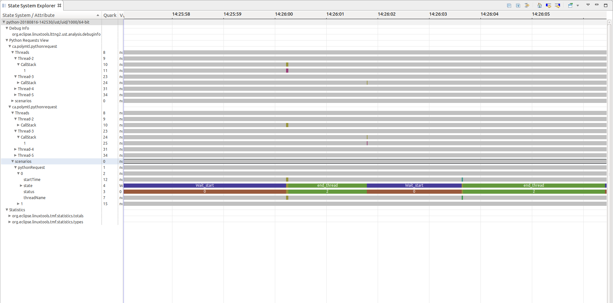

## Python XML analysis

In this lab, you will learn to trace a python application using lttng library `lttngust`, write an xml analysis file to create your own view, and visualize your application with your own tracepoints.

*Pre-requisites*: Have Trace Compass installed and opened. Have git, lttng, Python 3.X, pip and the callstack add-on on Trace Compass installed. You can follow the [Installing TraceCompass](../006-installing-tracecompass) lab or read the [TraceCompass website](http://tracecompass.org) for more information.

- - -

### Task 1: Writing the code

For this lab, you will be using a web server example using Flask. This server makes use of the `lttngust` library. To use the lttng ust agent you have to import the LTTng-UST Python agent:

```python
import lttngust
```

The agent automatically adds its logging handler to the root logger at import time. By adding this handler, every log statement creates an LTTng event (more details available in the [LTTng documentation](https://lttng.org/docs/v2.10/#doc-python-application)). The goal in this lab is to track the behaviour of the server, therefore we will create an event before and after each time the server receive a request. In order to do that we will create two functions `tracing_entry` and `tracing_exit` and add them to the flask built-in handlers:

```python
def tracing_entry():
    app.logger.info("route_entry")

def tracing_exit(response):
    app.logger.info("route_exit")
    return response

[...]

if __name__ == "__main__":
    app.before_request(tracing_entry)
    app.after_request(tracing_exit)
    app.run(port=5000)
```

- - -

### Task 2: Tracing the python application

To run the server script given in this lab you need to install the lttngust and flask libraries.
```bash
$ pip install lttngust flask
# If you have ubuntu, it may be easier this way:
$ python3 -m pip install lttngust flask
```

In order to record a trace with python events you need to create an lttng session and enable python events:

```bash
# In console 1:
$ lttng create python
$ lttng enable-event --python -a
$ lttng start
$ python3 server.py

# In console 2:
$ curl localhost:5000 && curl localhost:5000/resource1 && curl localhost:5000/resource2 && curl localhost:5000/resource3 && curl localhost:5000/resource4

# In console 1:
# ctrl-c to stop the server
$ lttng stop
$ lttng view # Optional, displays the events recorded
$ lttng destroy
```
If the server takes too long (5 seconds or more), it is possible that the LTTng agent could not register with the session daemon and in that case, the trace will not contain any event. If you run python in a virtual environment, it could prevent the agent from connecting to the session daemon.

- - -

### Task 3: Writing the XML analysis

This python application is very simple and have router entry and exit tracepoints. The XML file for this analysis is available [in this lab's directory](python-analysis.xml). You may download it and import it in Trace Compass.

- - -

### Task 4: Running the XML analysis

After importing the trace into Trace Compass, you need to apply an XML analysis on a ust trace to enable certain views to display the state you want to analyze. To enable the XML analysis in your tracing project, you need to right click on the folder above your trace in the project explorer. Then select `Manage XML analyses...`, import your xml file, apply and close the window.


Once these actions are done, you can open the `Flame Chart` View, under the `Python Views`, to visualize the different queries that have been executed on the python server.

- - -

### Task 5 (optional): Debugging the state system

Sometimes, when working with XML analysis, things don't work out the way you want them to. One very useful tool to use in this case is the `State System Explorer` View. This view displays the internal values of the state system, the backend used to store the data of the analyses. It shows how the values of the states change in time, and you can thus relate it with events. Did an event trigger the expected state change? What value is really stored at a certain time. It can be opened via the *Window* > *Show View* menu and searching for `State System Explorer`.



- - -

### Conclusion

In this tutorial, you wrote some simple python code that creates LTTng events, then you traced that application to analyze its behaviour. We've seen that even though the events recorded in the application are not builtin events, it is still possible to analyze them in Trace Compass with the help of some data driven analyses, to create your own states and show your own views. This is very useful because most userspace applications, unless traced with one of the provided lttng-ust preloaded libraries, will define their own events, following their own logic. XML analyses can be defined for your specific application, and then used for all traces of this application.

- - -

### References

* [More documentation on XML analyses](http://archive.eclipse.org/tracecompass/doc/stable/org.eclipse.tracecompass.doc.user/Data-driven-analysis.html#Data_driven_analysis)
* [Documentation on tracing python applications](https://lttng.org/docs/v2.10/#doc-python-application)

- - -

#### Next

* [PHP Userspace Tracing](../205-tracing-php-userspace)
or
* [Back](../) for more options
