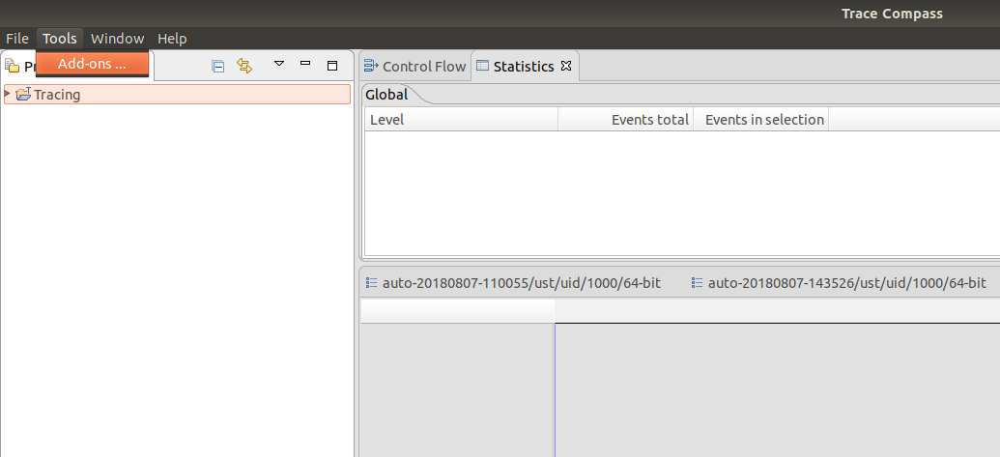
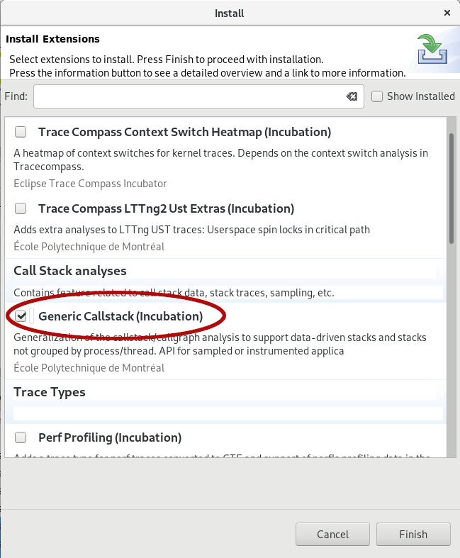

## Tracing php in userspace

In this lab, you will learn how to trace a php program and visualize the execution of a program in a flame graph.

*Pre-requisites*: Have Trace Compass installed and opened. You can follow the [Installing TraceCompass](../006-installing-tracecompass/) lab or read the [TraceCompass web site](http://tracecompass.org) for more information. You should have followed [the basic navigation lab](../101-trace-navigation-in-tracecompass/). Have Php 7.x and Lttng >= 2.8 installed.

- - -

### Task 1: Configure Lttng extension

Unlike python or Java, there is no agent in PHP that allows to insert tracepoints in php code and get events in lttng. But with an extension, it is possible to generate events for all php function entries and exits, just like the lttng-ust-cyg-profile for C/C++ applications. You can build and install this extension from source which is straightforward:

```bash
$ git clone https://github.com/naser/LTTng-php-tracing-module.git
$ cd LTTng-php-tracing-module
$ phpize
# Before configuration, make sure you have LTTng 2.X installed in your machine. For installation manual refer to: http://lttng.org/docs/v2.9/#doc-installing-lttng
$ ./configure
$ make
$ sudo make install
```

After installation you will need to add `extension=lttng.so` to your primary *php.ini* file. To do so, run `php -m` in the command line to check if lttng is among the installed php extensions. If it is not there, you should manually enable it.

```bash
$ php --ini
```

Open the `php.ini` with an editor, search for 'Exentions' (or 'Dynamic Extensions') within the ini file and add this line there:
```
extension=lttng.so
```

Now run the `php -m` (or `php -m | grep lttng`) in the command line and this time you should see the lttng in the installed and enabled modules
```bash
# To see if lttng extension is loaded
$ php -m | grep lttng
lttng
```

- - -

### Task 2: Record a php trace

We provided a simple PHP script with this lab called `simplePhpScript.php` which contains an implementation of quicksort and sorts arrays in average or worst case. We can trace this php code with the following script:

```bash
$ lttng-record-trace -p php php simplePhpScript.php
```

If you use `babeltrace` to read the trace, the output should look like this:
```
[15:52:23.512328851] (+0.001567556) naserez-desktop ust_php:request_entry: { cpu_id = 4 }, { vtid = 26387 }, { path = "/usr/local/apache2/htdocs/simple.php", uri = "-", method = "-", querystring = "(null)" }
[15:52:23.512378022] (+0.000049171) naserez-desktop ust_php:compile_file_entry: { cpu_id = 4 }, { vtid = 26387 }, { filename = "simple.php", type = 8 }
[15:52:23.512404852] (+0.000026830) naserez-desktop ust_php:compile_file_exit: { cpu_id = 4 }, { vtid = 26387 }, { filename = "simple.php", type = 8 }
[15:52:23.512416960] (+0.000012108) naserez-desktop ust_php:execute_entry: { cpu_id = 4 }, { vtid = 26387 }, { filename = "/usr/local/apache2/htdocs/simple.php", lineno = 3 }
[15:52:23.512417407] (+0.000000447) naserez-desktop ust_php:function_entry: { cpu_id = 4 }, { vtid = 26387 }, { funcname = "main", filename = "/usr/local/apache2/htdocs/simple.php", lineno = 3, class_name = "", scope = "" }
[15:52:23.512429890] (+0.000012483) naserez-desktop ust_php:execute_entry: { cpu_id = 4 }, { vtid = 26387 }, { filename = "/usr/local/apache2/htdocs/simple.php", lineno = 3 }
[15:52:23.512432382] (+0.000002492) naserez-desktop ust_php:trace_print: { cpu_id = 4 }, { vtid = 26387 }, { marker = "start" }
[15:52:23.512433312] (+0.000000930) naserez-desktop ust_php:execute_exit: { cpu_id = 4 }, { vtid = 26387 }, { filename = "/usr/local/apache2/htdocs/simple.php", lineno = 3 }
[15:52:23.512441214] (+0.000007902) naserez-desktop ust_php:execute_entry: { cpu_id = 4 }, { vtid = 26387 }, { filename = "/usr/local/apache2/htdocs/simple.php", lineno = 7 }
[15:52:23.512441602] (+0.000000388) naserez-desktop ust_php:trace_print: { cpu_id = 4 }, { vtid = 26387 }, { marker = "end" }
[15:52:23.512441823] (+0.000000221) naserez-desktop ust_php:execute_exit: { cpu_id = 4 }, { vtid = 26387 }, { filename = "/usr/local/apache2/htdocs/simple.php", lineno = 7 }
[15:52:23.512442456] (+0.000000633) naserez-desktop ust_php:function_exit: { cpu_id = 4 }, { vtid = 26387 }, { funcname = "main", filename = "/usr/local/apache2/htdocs/simple.php", lineno = 3, class_name = "", scope = "" }
[15:52:23.512442803] (+0.000000347) naserez-desktop ust_php:execute_exit: { cpu_id = 4 }, { vtid = 26387 }, { filename = "/usr/local/apache2/htdocs/simple.php", lineno = 3 }
[15:52:23.512444673] (+0.000001870) naserez-desktop ust_php:request_exit: { cpu_id = 4 }, { vtid = 26387 }, { path = "/usr/local/apache2/htdocs/simple.php", uri = "-", method = "-", querystring = "(null)" }
```

- - -

### Task 3: Install the Generic Callstack add-on

To visualize the call stack of an application in a flamegraph you need to install the *Generic Callstack (Incubation)* add-on from the *Tools > Add-ons* menu.



In the *Install* wizard, you may check the *Generic Callstack (Incubator)* feature. Then click *Finish*



- - -

### Task 4: Import the trace into Trace Compass

After importing the trace, you need to add an analysis XML file to enable php callstack analysis on TraceCompass.


After opening the *Manage XML analyses files* window you need to click on the `Import` button and search for the [final-php-callstack.xml](final-php-callstack.xml) file. After importing this file you can click on the `Apply and Close` button.


- - -

### Task 5: Opening the Flame Chart

Now that everything is setup you should be able to open the *Flame Chart* in the *Project Explorer View* in *Views > PHP Callstack View > Flame Chart (incubator)*. If you ran the script.php or opened the trace given in this lab, it should look like this:


If you look at the code, there is actually 2 executions of the same `quicksort` function. The first execution is an average case scenario where the array elements are randomly sorted, and the second execution is a worst case scenario where the array element are sorted in reverse order.
In the trace it can easily be seen that the second execution is much faster and takes a lot less function calls. This view can be very useful to analyze what is actually happening when the program is running, and what functions gets called.

- - -

### Conclusion

In the lab you learned how to trace a php program, and how to setup *Trace Compass* to visualize this PHP User space trace in a Flame Chart. You should now be able to use these tools to better understand the execution of an application, and visualize what units of code have to be refactored to obtain better performance.

- - -

### References

* [PHP extension for lttng tracing](https://github.com/naser/LTTng-php-tracing-module.git)
* [More documentation on XML analyses](http://archive.eclipse.org/tracecompass/doc/stable/org.eclipse.tracecompass.doc.user/Data-driven-analysis.html#Data_driven_analysis)

- - -

#### Next

* [Advanced topic: Tracing multiple machine](../301-tracing-multiple-machine)
or
* [Back](../) for more options
