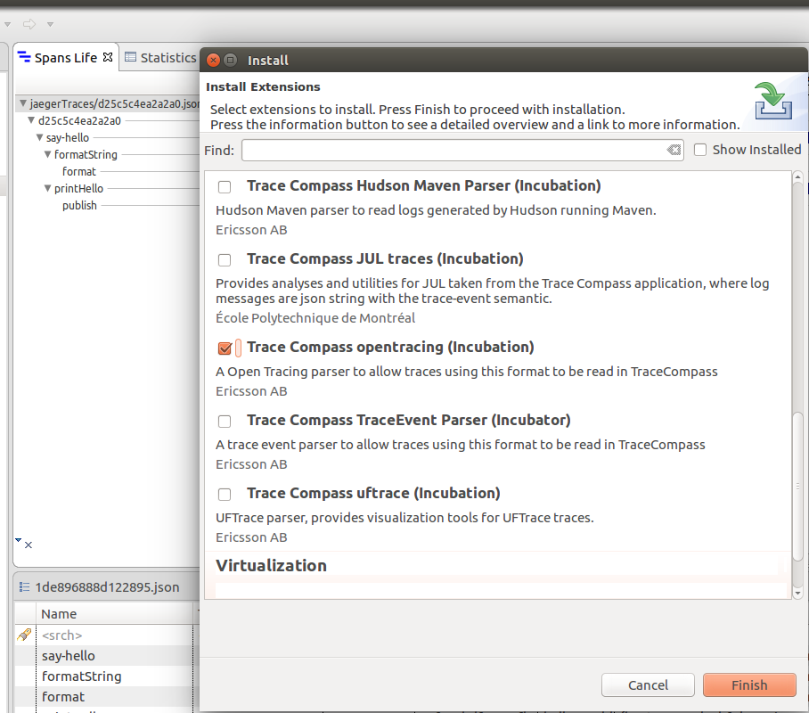
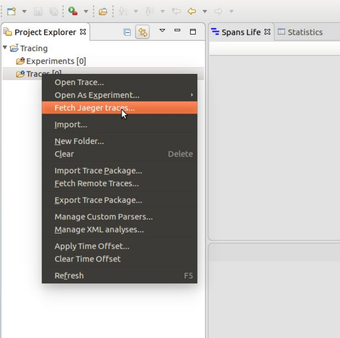
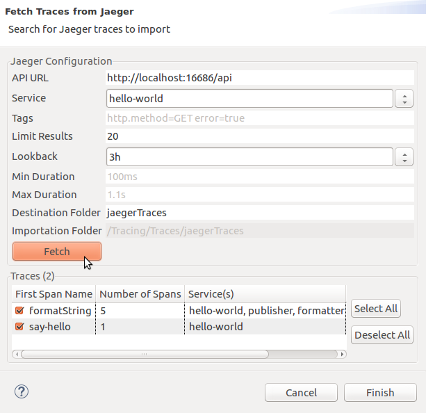
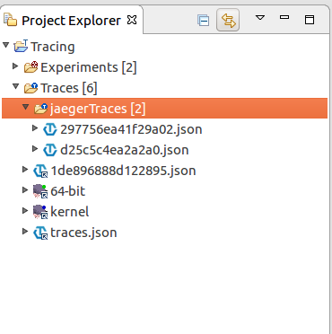
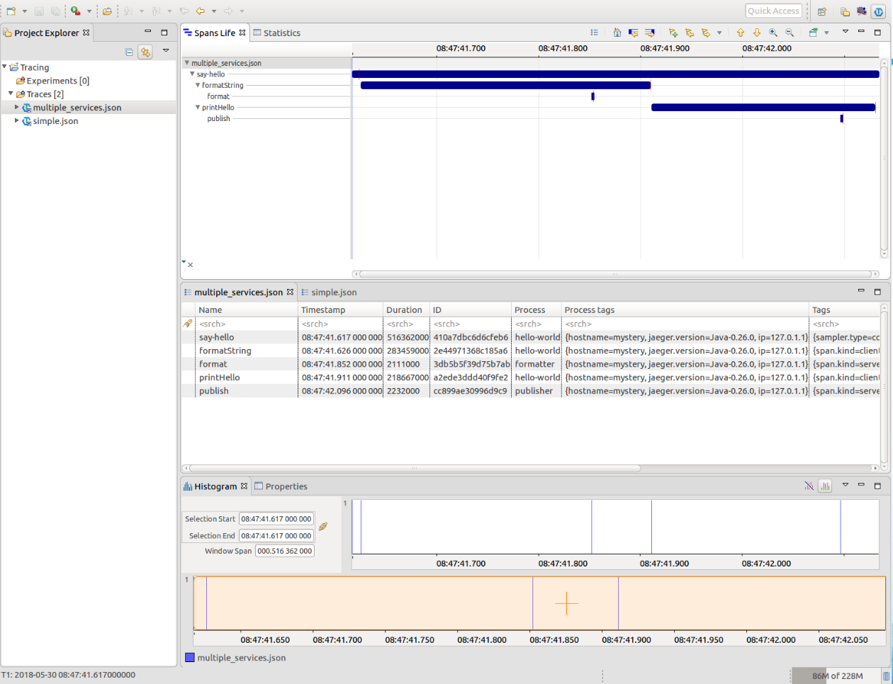
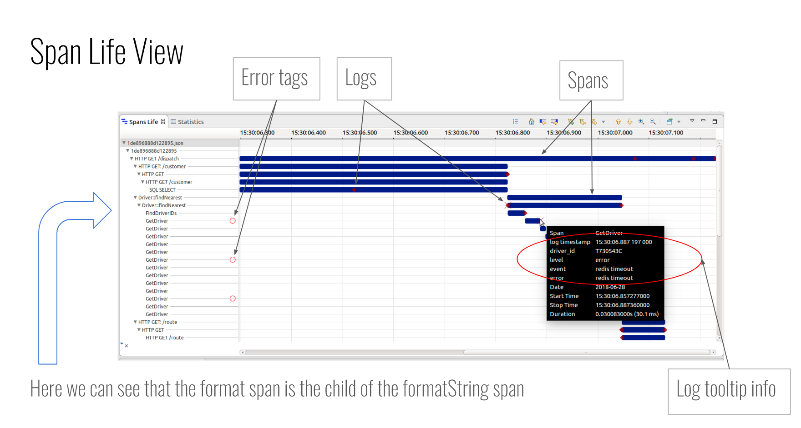
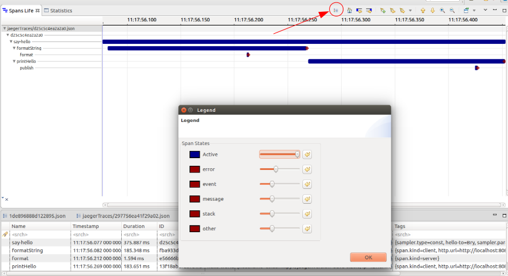

## Importing and Analysing Jaeger Traces in Trace Compass

In this lab, you will learn to use Trace Compass to upload and analyse Jaeger traces, obtained from distributed applications instrumented with OpenTracing API. Jaeger already provides a very good visualization of those traces, but with TraceCompass, those traces can be analyzed along with other system and application traces.

*Pre-requisites*: Have Trace Compass installed and opened. You can follow the [Installing TraceCompass](../006-installing-tracecompass) lab or read the [TraceCompass web site](https://tracecompass.org) for more information. This lab is not a tutorial about OpenTracing or Jaeger. It supposes that you know about these, but it provides all the necessary material to use Trace Compass with example traces, without having access to a Jaeger infrastructure.

**Note** at the time of this presentation, Trace Compass v4.2 has not yet been released. For the best experience with trace compass 4.1 follow these steps:

1. Go to Help->Install New Software->Manage...
2. Select the Trace Compass RCP entry
3. Click on Edit
4. Change the word "stable" for "master" in the url
5. Close the windows clicking "on "close"
6. Close the "Available Software" window.
7. click on Help->Check for Updates
8. Follow the instructions.

- - -

### Task 1: Tracing with Jaeger

All you need to know to start tracing can be found on Jaeger Tracing website.

[Getting started with Jaeger](https://www.jaegertracing.io/docs/getting-started/)

- - -

### Task 2: Installing Open Tracing Plug-in

You can install the *Open Tracing* trace type in *Tools* -> *Adds-on...*. Check the `Trace Compass opentracing (incubation)` feature and click *Finish*. Follow the instructions on screen.

- - -

### Task 3: Fetching Jaeger Traces

Once you have Jaeger running and traced some traces, you can fetch those traces directly into Trace Compass. All you need to do is right click on the Traces folder in the Project Explorer.

You will be able to set all the filters you want to apply to your traces request. Once you click the fetch button, you will see a list of traces which you can select the ones you want to import from.

Once you click finish, your traces will be imported in your workspace.

You can also open one of the traces in the `traces` directory of this lab.

- - -

### Task 4: Exploring the perspective components

When you open an Open Tracing trace (double click on any imported trace), you should obtain a view that looks like this.

Open Tracing perspective contains:

- Project Explorer: List of your experiments as well as your traces.
- Spans Life View: Time graph representation of the span's relationships.
- Events Table: Information of every every event as well as every span in the trace. Equivalent of the Jaeger "Spans List".
- Histogram: Overview of the spans occurences on a time basis.

- - -

### Task 5: Analysing an Open Tracing Trace

The main view is the `Span Life` view. It provides an overview of the spans. On the left of the view we can see the list of spans aggregated based on the child-parent relationships between the spans. You can also see a red circle next to some span name that represent an error tag. Different symbols are displayed on the spans where there are logs. Each symbol represents a certain type of log. For exemple, `X`'s are errors. If you place your cursor over a log, you will have the information relative to this particular log.

You can access the legend via the legend button on top of the Span Life View. You have the possibility to change the color and the size of the different logs symbols.

- - -

### Conclusion

This lab shows the work that has been done to integrate OpenTracing API instrumented applications in Trace Compass. Jeager is the provider of the traces in our case. With system traces to augment this data, we could know what is happening during the spans. There is a lot of future work still to do for this feature. Feedback is welcome.
