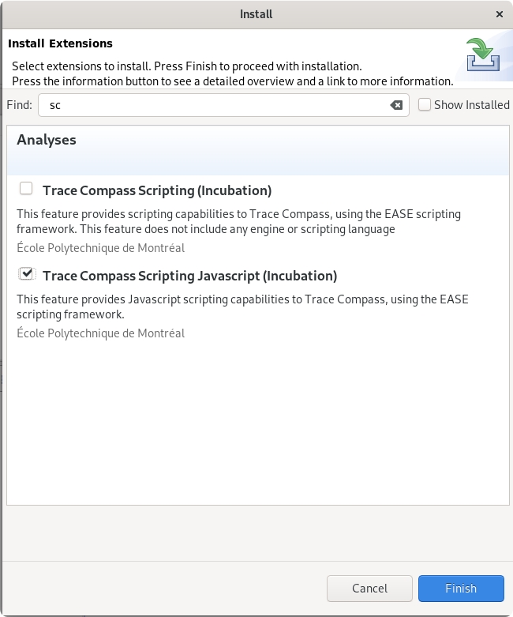

## Scripting Your Analyzes And Views

In this lab, you will learn to make your own additional analyzes, views and act on those in Trace Compass using one of many available scripting languages. This features uses the `[EASE Framework](https://www.eclipse.org/ease/)` from Eclipse. Scripting can be used with any trace or experiment that can be opened with Trace Compass.

*Pre-requisites*: Have Trace Compass installed and opened. You can follow the [Installing TraceCompass](../006-installing-tracecompass) lab or read the [TraceCompass web site](https://tracecompass.org) for more information.

- - -

### Task 1: Installing the Scripting Plug-ins

You can install the *Open Tracing* trace type in *Tools* -> *Adds-on...*. Check the `Trace Compass Scripting (incubator)` and `Trace Compass Scripting Javascript (incubator)` feature and click *Finish*. Follow the instructions on screen.



- - -

### Task 2: Understand How EASE Scripting Works

EASE is a scripting environment for Eclipse, which allows to run code in the context of the running Java/Eclipse instance. In practice, that means it can run any script of a particular language (for eg. any python script can be run through EASE), plus it adds ways to access Java code and methods directly and interact with the running application.

EASE, as a framework, allows applications, like Trace Compass, to write module classes that provide methods that can be directly called by a script once the module is loaded. Those methods are helper methods that give direct access to the application's inside. But if no helper method is available for a certain operation, the script still has access to all of the application's code and API, using the full path of classes! It is thus a very powerful feature that let users do almost anything they wish!

The following screenshot shows a schema of EASE, with the various engines and modules available.


- - -

### Task 3: Display an XY View From An Existing Analysis

```javascript
loadModule("/TraceCompass/Trace");
loadModule('/TraceCompass/Analysis');
loadModule('/TraceCompass/DataProvider');
loadModule('/TraceCompass/View');

// Get the currently active trace
var trace = getActiveTrace();

if (trace == null) {
	  print("Trace is null");
	  exit();
}

// Get the Statistics module (by name) for that trace
var analysis = getTraceAnalysis(trace, 'Statistics');
if (analysis == null) {
	  print("Statistics analysis not found");
	  exit();
}

// Prepare the parameters for the data provider:
var map = new java.util.HashMap();
map.put(ENTRY_PATH, 'event_types/sched_wakeup|syscall_exit_futex');
map.put(ENTRY_DELTA, true);
// create a XY data provider
var provider = createXYProvider(analysis, map);

// Open an XY chart with this data provider
if (provider != null) {
	  openXYChartView(provider);
}
```

- - -

### Task 4: Create A Time Graph With Data From Trace

- - -

### Task 5: Generate Automatic Filters For A Trace

```javascript
loadModule("/TraceCompass/Trace");
loadModule("/TraceCompass/Analysis");
loadModule("/TraceCompass/Filters");
loadModule("/TraceCompass/View");

// Set the symbol to look for, needs some insight in the trace
var mySymbol = "DecoderDecode";

// Get the currently active trace
var trace = getActiveTrace();
if (trace == null) {
	print("Active trace is null. You must open a trace first");
	exit();
}

// Execute the OS Execution Graph analysis as we know this may take time and we'll need it.
var analysis = getTraceAnalysis(trace, "OS Execution Graph");
if (analysis == null) {
	print("OS Execution graph not available");
} else {
	// Schedule the analysis
	analysis.schedule();
}

// Get the analysis by its name, as seem under the Views element of the trace
var analysis = getTraceAnalysis(trace, "LTTng-UST CallStack (Incubator)");
if (analysis == null) {
	print("LTTng UST Callstack Analysis not found. Is the right trace opened? The right events are enabled?");
	exit();
}
// Schedule the analysis and wait for its completion
analysis.schedule();
analysis.waitForCompletion();

// The callstack's analysis segment store contains all the function calls, that's how we'll parse the functions
var segmentStore = analysis.getSegmentStore();
if (segmentStore == null) {
	print("Callstack store is not available");
	exit();
}

// Get the symbol providers for this trace, calling the Trace Compass' SymbolProviderManager directly
// The full Trace Compass API is available here: https://archive.eclipse.org/tracecompass/doc/javadoc/apidocs/
var symbolProviders = org.eclipse.tracecompass.tmf.core.symbols.SymbolProviderManager.getInstance().getSymbolProviders(trace);
// Define the function to resolve the function's symbol
function getSymbol(funcSegment) {
	return org.eclipse.tracecompass.tmf.core.symbols.SymbolProviderUtils.getSymbolText(symbolProviders, funcSegment.getProcessId(), funcSegment.getStart(), funcSegment.getSymbol());
}

// Function to manage the array of TIDs in javascript
function addTidToArray(arr, tid) {
	for (i = 0; i < arr.length; i++) {
		if (arr[i] == tid) {
			return;
		}
	}
	arr.push(tid);
}

// Calculate the average duration, by parsing the segment store
var total = 0;
var cnt = 0;
var tids = new Array();
var iterator = segmentStore.iterator();
while (iterator.hasNext()) {
	var traceFunc = iterator.next();
	var symbol = getSymbol(traceFunc);
	// Ignore all function calls that are not for that symbol
	if (symbol.equals(mySymbol)) {
		// Add the thread ID to the array of thread IDs
		tid = traceFunc.getThreadId();
		if (tid > 0) {
			addTidToArray(tids, tid);
		}
		total += traceFunc.getLength();
		cnt++;
	}
}

// No function call was found for that symbol
if (cnt == 0) {
	print("Function " + mySymbol + " not found, exiting");
	exit();
}

//Filter on functions 1/3 above average
avg = total / cnt;
limit = avg + avg / 3;
print("The average duration for the '" + mySymbol + "' symbol is " + avg + " ns");
print("Now filtering on function calls with a duration > " + limit + " ns");

// Open the appropriate views
showView("org.eclipse.linuxtools.tmf.analysis.graph.ui.criticalpath.view.criticalpathview");
showView("org.eclipse.tracecompass.incubator.callstack.ui.views.flamechart", analysis.getId());
showView("org.eclipse.tracecompass.incubator.internal.callstack.ui.flamegraph.flamegraphView", analysis.getId());
// This view does not exist in Trace Compass, but since we have a segment store, we can create it here! But if no filter is enabled, it may be very inefficient and cause Trace Compass to temporarily hang
showView(org.eclipse.tracecompass.analysis.timing.ui.views.segmentstore.table.SegmentStoreTableView.ID, analysis.getId());

// Filter for the symbol
var filter = "\"" + mySymbol + "\" && " + org.eclipse.tracecompass.tmf.core.TmfStrings.duration() + " > " + limit;

// Add a filter on the TIDs for other views
if (tids.length > 0) {
	filter = "(" + filter + ") || (!(\"Function name\" present) && !(\"Symbol\" present) && (" + org.eclipse.tracecompass.analysis.os.linux.core.model.OsStrings.tid() + " == " + tids.join(" || " + org.eclipse.tracecompass.analysis.os.linux.core.model.OsStrings.tid() + " == ") + "))";
	org.eclipse.tracecompass.tmf.core.signal.TmfSignalManager.dispatchSignal(new org.eclipse.tracecompass.analysis.os.linux.core.signals.TmfThreadSelectedSignal(this, tids[0], analysis.getTrace()));
}
print("");
print("Applying filter: " + filter);
applyGlobalFilter(filter);
```

- - -

### References

* [Trace Compass Scripting Documentation](https://archive.eclipse.org/tracecompass.incubator/doc/org.eclipse.tracecompass.incubator.scripting.doc.user/User-Guide.html)
* [Example EASE scripts](https://archive.eclipse.org/tracecompass.incubator/doc/javadoc/apidocs/org/eclipse/tracecompass/incubator/scripting/core/doc-files/examples.html)
* [Introduction to Trace Compass Scripting](http://versatic.net/tracecompass/introducingEase.html) blog post
* [Trace Compass Incubator and Scripting API](https://archive.eclipse.org/tracecompass.incubator/doc/javadoc/apidocs/)
* [Trace Compass API](https://archive.eclipse.org/tracecompass/doc/javadoc/apidocs/)

- - -

### Conclusion

This lab showed how easily a user can extend the Trace Compass visualization tool to adapt to custom traces and add new analyzes to supported traces, or just script one's workflow through the tools when opening new traces.
